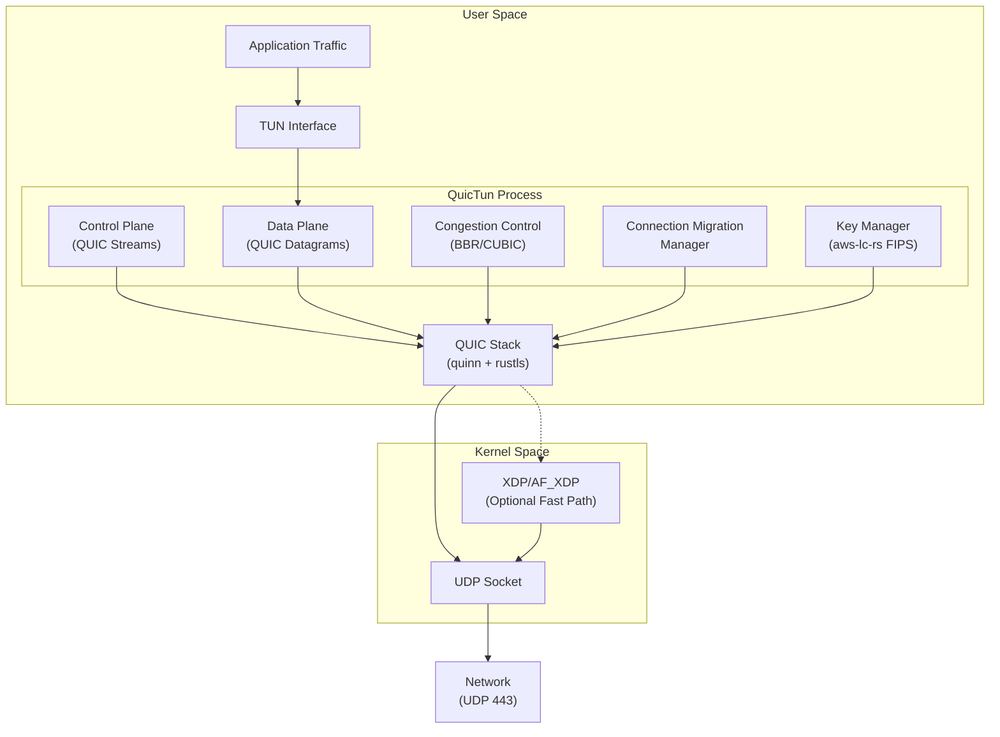
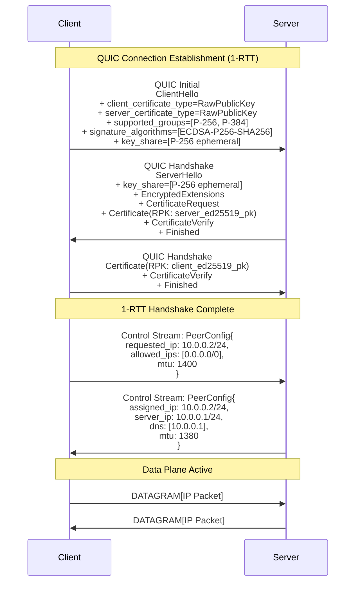
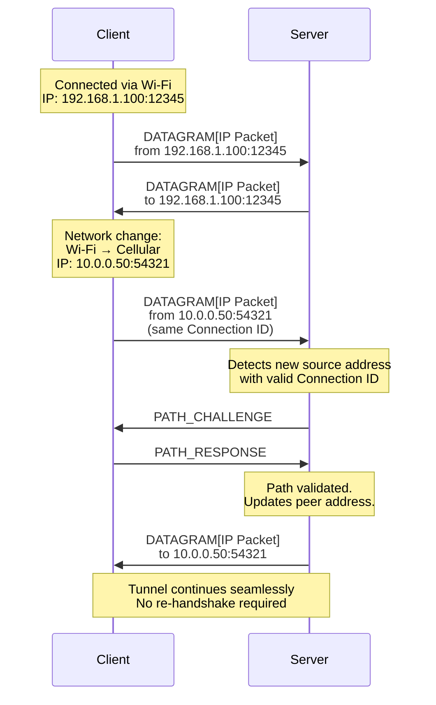
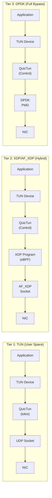

# QuicTun: A QUIC-Based Secure Tunnel Primitive Built on RFC-Standardized Protocols

**Authors:** SeoulValley Engineering

**Date:** February 2026

**Version:** 1.0

---

## Abstract

WireGuard established a new standard for VPN simplicity, but its design choices — the Noise protocol framework with Curve25519, ChaCha20-Poly1305, and BLAKE2s — create barriers in environments requiring FIPS 140-3 compliance. Its fixed UDP port is trivially blocked by restrictive firewalls, and it lacks native support for connection migration.

We present **QuicTun**, a secure tunnel primitive built directly on QUIC (RFC 9000) and TLS 1.3 (RFC 8446), leveraging Raw Public Keys (RFC 7250) for WireGuard-style identity management without the overhead of X.509 certificate infrastructure. Like WireGuard, QuicTun is a point-to-point tunnel — it creates a secure, encrypted link between two peers. What operators build on top of it (site-to-site VPN, remote access gateway, mesh overlay, multi-hop relay) is an application-layer concern, not a protocol concern. By adopting QUIC as the transport layer, QuicTun inherits encryption, multiplexing, congestion control, and connection migration as first-class protocol features rather than re-implementing them.

Our per-packet overhead analysis demonstrates that QuicTun with zero-length Connection IDs achieves a **20-byte overhead** per tunneled packet — 37.5% less than WireGuard's 32-byte overhead — while operating over a fully RFC-standardized protocol stack. Because QuicTun's entire cryptographic layer delegates to aws-lc-rs (FIPS 140-3 Certificate #4631), deployments requiring FIPS compliance can enable it through configuration rather than architectural changes. QuicTun operates on UDP port 443, making it indistinguishable from standard QUIC/HTTP3 traffic to network middleboxes and DPI systems.

---

## 1. Introduction

### 1.1 The Problem

Encrypted tunnels are a foundational network primitive. The design space spans personal VPNs, site-to-site links, service mesh encryption, and enterprise remote access. Despite this diversity, most deployments share common requirements:

1. **Standards-based cryptography** — RFC-standardized, widely audited protocols reduce risk and enable regulatory compliance (FIPS 140-3) when needed.
2. **Network traversal** — Firewalls, hotel networks, and restrictive enterprise environments increasingly block non-standard UDP traffic, requiring tunnels that blend with legitimate web traffic.
3. **Mobile continuity** — Devices roam between Wi-Fi, cellular, and wired networks, requiring seamless connection migration without session re-establishment.

Legacy solutions (IPsec/IKEv2, OpenVPN) use standardized cryptography but suffer from protocol complexity and poor performance. WireGuard delivers simplicity and speed but uses non-standard cryptographic primitives, a fixed protocol fingerprint, and lacks connection migration.

### 1.2 WireGuard's Limitations

WireGuard [Donenfeld 2017] is widely recognized for its minimal attack surface (~4,000 lines of kernel code) and cryptographic elegance. However, its design choices create fundamental barriers to enterprise adoption:

- **Non-FIPS cryptography.** WireGuard's Noise_IKpsk2 handshake uses Curve25519, ChaCha20-Poly1305, BLAKE2s, and SipHash — none of which appear on the FIPS 140-3 approved algorithm list. Red Hat explicitly documents that "WireGuard is not FIPS-compliant" and disables it in FIPS mode [Red Hat 2024].
- **Fixed protocol fingerprint.** WireGuard uses a distinctive 4-byte message type header (0x01–0x04) that is trivially identified by DPI systems. Its fixed UDP port (default 51820) is commonly blocked by enterprise firewalls.
- **No connection migration.** WireGuard binds sessions to source IP:port tuples. Network transitions require full handshake re-establishment, causing visible latency for mobile users.
- **No congestion control.** WireGuard is a Layer 3 tunnel that passes packets without rate adaptation, relying entirely on inner-protocol congestion control. This can cause bufferbloat and unfairness in shared network environments.

### 1.3 Contributions

This paper makes the following contributions:

1. **Architecture.** We present QuicTun, a tunnel primitive that uses QUIC datagrams (RFC 9221) for data-plane transport and QUIC streams for control-plane signaling, achieving clean separation of concerns over a single UDP flow.
2. **Overhead analysis.** We provide a byte-level comparison showing QuicTun achieves 20-byte per-packet overhead (with zero-length CIDs), compared to WireGuard's 32 bytes.
3. **FIPS-ready cryptography.** We describe a cryptographic architecture that delegates all primitives to aws-lc-rs (FIPS 140-3 Certificate #4631), enabling FIPS-compliant operation through a configuration flag without architectural changes.
4. **Firewall traversal.** We demonstrate that QuicTun on UDP 443 is protocol-indistinguishable from standard HTTP/3 traffic to passive DPI systems.
5. **Performance tiers.** We present a three-tier architecture (TUN, XDP/AF_XDP, DPDK) enabling deployment from 1 Gbps edge nodes to 100 Gbps data center gateways.

---

## 2. Background and Related Work

### 2.1 QUIC Protocol Suite

QUIC is a UDP-based, multiplexed transport protocol standardized by the IETF in 2021. The core specification spans four RFCs, all at Proposed Standard status:

- **RFC 9000** — QUIC: A UDP-Based Multiplexed and Secure Transport. Defines connection establishment, stream multiplexing, flow control, and connection migration.
- **RFC 9001** — Using TLS to Secure QUIC. Mandates TLS 1.3 as the handshake protocol, integrating encryption at the transport layer rather than as a separate session layer.
- **RFC 9002** — QUIC Loss Detection and Congestion Control. Specifies the loss recovery and congestion control algorithms, defaulting to a variant of NewReno with provisions for alternative algorithms (e.g., CUBIC, BBR).
- **RFC 9221** — An Unreliable Datagram Extension to QUIC. Extends QUIC with unreliable DATAGRAM frames, enabling applications to send data without stream-level reliability — ideal for VPN tunneling where inner protocols handle their own retransmission.

QUIC's design is particularly well-suited for VPN tunneling because it provides:

- **Mandatory encryption** via TLS 1.3, eliminating the need for a separate cryptographic layer
- **Connection migration** via Connection IDs that decouple sessions from network addresses
- **Built-in congestion control** preventing the tunnel from overwhelming the network path
- **Multiplexing** allowing control and data channels to share a single UDP 4-tuple
- **1-RTT handshake** (0-RTT for resumption), minimizing connection setup latency

### 2.2 WireGuard

WireGuard [Donenfeld 2017] established a new benchmark for VPN simplicity. Its key design choices include:

- **Noise_IKpsk2 handshake** — A two-message handshake providing mutual authentication, forward secrecy, and identity hiding using static Curve25519 keys.
- **Cryptokey routing** — A routing table that maps allowed IP ranges to peer public keys, merging routing and access control into a single primitive.
- **Minimal state machine** — No session negotiation, no cipher agility, no version negotiation. The protocol has exactly four message types.

These choices produce an exceptionally clean protocol but preclude FIPS compliance, cipher agility, and connection migration.

### 2.3 MASQUE and Industry Adoption

MASQUE (Multiplexed Application Substrate over QUIC Encryption) defines mechanisms for proxying UDP (RFC 9298) and IP (RFC 9484) traffic over HTTP/3 CONNECT methods. Several major deployments signal industry convergence toward QUIC-based tunneling:

- **Cloudflare WARP** is migrating from WireGuard to a MASQUE-based architecture, citing connection migration and firewall traversal as primary motivations [Cloudflare 2024].
- **Mullvad VPN** uses MASQUE as an obfuscation layer to wrap WireGuard traffic in QUIC, enabling traversal of networks that block raw WireGuard [Mullvad 2024].
- **Cisco** has integrated MASQUE-based tunneling into its secure access service edge (SASE) products [Cisco 2024].

QuicTun differs from MASQUE-based approaches by operating at Layer 3 directly over QUIC datagrams rather than proxying through HTTP/3, eliminating the HTTP framing overhead and complexity.

### 2.4 Existing QUIC-Based VPNs

Several projects have explored QUIC for VPN tunneling:

- **TUIC** — A proxy protocol using QUIC streams for TCP proxying and datagrams for UDP, focused on censorship circumvention rather than enterprise VPN.
- **Hysteria** — A censorship-resistant proxy built on a modified QUIC implementation (quic-go) with custom congestion control (Brutal), optimized for lossy networks.
- **oVPN over QUIC** — OpenVPN's experimental QUIC transport, which layers the existing OpenVPN protocol over QUIC streams, inheriting OpenVPN's significant per-packet overhead.

None of these projects provide the zero-overhead datagram tunneling or FIPS-ready cryptographic architecture that QuicTun achieves.

### 2.5 FIPS 140-3

FIPS 140-3 (Federal Information Processing Standard) specifies security requirements for cryptographic modules used within federal information systems. Key requirements include:

- **Approved algorithms only** — AES-128/256-GCM, SHA-256/384/512, ECDHE (P-256/P-384), ECDSA, RSA (2048+)
- **Module boundary** — A defined cryptographic boundary encapsulating all key material and cryptographic operations
- **Self-tests** — Power-on self-tests (POST) and conditional self-tests for algorithm validation
- **Key management** — Secure key generation, storage, zeroization, and lifecycle management

WireGuard's primitives — Curve25519, ChaCha20-Poly1305, BLAKE2s — are not FIPS-approved. While ChaCha20-Poly1305 is under consideration, Curve25519 and BLAKE2s remain outside the approved list as of 2026.

### Table 1: VPN Feature Comparison Matrix

| Feature | WireGuard | IPsec/IKEv2 | OpenVPN | MASQUE | **QuicTun** |
|---|---|---|---|---|---|
| FIPS 140-3 ready | No | Yes | Yes | Yes | **Yes** |
| Connection migration | No | IKEv2 MOBIKE | No | Yes | **Yes** |
| Built-in congestion control | No | No | No | Yes | **Yes** |
| Firewall traversal (443) | No | UDP 500/4500 | TCP 443 | Yes | **Yes** |
| 1-RTT handshake | Yes (1-RTT) | 2-RTT | 2+ RTT | 1-RTT | **1-RTT** |
| Per-packet overhead | 32 B | 50–73 B | 46–69 B | 29+ B | **20 B** |
| DPI resistance | Low | Low | Medium | High | **High** |
| RFC standardized transport | No | Yes | No | Yes | **Yes** |
| Kernel-mode data path | Yes | Yes | No | No | **Yes (XDP)** |
| Code complexity | ~4K LoC | ~100K+ LoC | ~100K+ LoC | Varies | **~15K LoC** |

---

## 3. Design Goals and Threat Model

### 3.1 Design Goals

QuicTun is designed to satisfy the following goals:

1. **FIPS-ready cryptographic architecture.** All cryptographic operations are delegated to a library with an existing FIPS 140-3 validation (aws-lc-rs). Enabling FIPS-compliant mode should require only a configuration change, not an architectural one.

2. **Minimal per-packet overhead.** The tunnel must add no more overhead than WireGuard per tunneled packet, preserving effective MTU for inner protocols.

3. **Firewall and DPI traversal.** The tunnel must operate on UDP port 443 and be indistinguishable from standard HTTP/3 traffic to passive deep packet inspection systems.

4. **Seamless connection migration.** Network transitions (Wi-Fi to cellular, DHCP renewal, NAT rebinding) must complete without visible interruption to tunneled sessions.

5. **Congestion-aware transport.** The tunnel must implement RFC-compliant congestion control to prevent bufferbloat and ensure fair coexistence with other traffic.

6. **Simple identity model.** Authentication must use static public keys (as in WireGuard) without requiring X.509 certificate infrastructure, while remaining compatible with enterprise PKI when needed.

7. **Scalable performance.** The architecture must support deployment from single-user endpoints (1–5 Gbps) to data center gateways (25–100 Gbps) through tiered data-plane implementations.

### 3.2 Threat Model

QuicTun assumes the following threat model:

**In scope:**
- Passive eavesdroppers on any network segment between peers
- Active network attackers capable of injecting, modifying, or replaying packets
- Deep packet inspection systems attempting to identify and block VPN traffic
- Compromised network infrastructure (rogue DHCP, DNS, ARP)
- Denial-of-service attacks against the tunnel endpoint

**Trust assumptions:**
- Endpoint devices are not compromised (kernel, hardware)
- The FIPS-validated cryptographic module (aws-lc-rs) is correctly implemented
- Peer public keys are distributed through a trusted out-of-band channel
- The operating system's random number generator is properly seeded

### 3.3 Scope and Non-Goals

QuicTun is a **tunnel primitive** — a secure, encrypted point-to-point link between two peers. Like WireGuard, it deliberately does not prescribe topology. Site-to-site VPN, remote access gateway, mesh overlay (analogous to Tailscale over WireGuard), and multi-hop relay are all valid compositions of QuicTun tunnels, built at the application or orchestration layer. The tunnel itself is topology-agnostic.

The following are explicitly out of scope for the tunnel primitive:

- **Anonymity.** QuicTun is not a Tor replacement. Traffic analysis resistance is not a design goal.
- **Censorship circumvention.** While QuicTun resists casual DPI, it does not implement active probing countermeasures designed for adversarial censorship environments (e.g., China's GFW).
- **Application-layer proxying.** QuicTun operates at Layer 3 (IP tunneling), not as an HTTP/SOCKS proxy.

---

## 4. Architecture Overview

### 4.1 System Architecture

QuicTun is a point-to-point tunnel primitive with a split-plane architecture: a **control plane** using QUIC streams for reliable, ordered signaling, and a **data plane** using QUIC DATAGRAM frames for unreliable, low-overhead IP packet transport.

**Figure 1: System Architecture**



### 4.2 Control Plane

The control plane uses bidirectional QUIC streams for:

- **Peer configuration exchange** — IP address assignment, allowed-IP ranges, MTU negotiation
- **Keepalive signaling** — Application-level keepalives supplementing QUIC's built-in idle timeout
- **Key rotation coordination** — Signaling for rekeying events beyond TLS 1.3's automatic key updates
- **Graceful shutdown** — Coordinated connection teardown

Using QUIC streams for control messages provides automatic reliability, ordering, and flow control without implementing a separate reliable transport.

### 4.3 Data Plane

The data plane uses QUIC DATAGRAM frames (RFC 9221) to transport tunneled IP packets. Each DATAGRAM frame carries a single IP packet without additional framing — the QUIC layer provides encryption, integrity, and replay protection.

Key properties of DATAGRAM frames for VPN use:

- **Unreliable delivery** — Lost datagrams are not retransmitted by QUIC, avoiding head-of-line blocking and allowing inner-protocol congestion control (e.g., TCP) to operate correctly.
- **Congestion-controlled** — DATAGRAM frames are subject to QUIC's congestion control, preventing the tunnel from overwhelming the network path.
- **Minimal framing** — A DATAGRAM frame adds only a type byte and length field, contributing to QuicTun's low per-packet overhead.

### 4.4 Connection Lifecycle

```
1. Client sends QUIC Initial (ClientHello with RPK)
2. Server responds with Handshake (ServerHello with RPK)
3. TLS 1.3 handshake completes (1-RTT)
4. Client opens control stream, sends configuration
5. Server responds with IP assignment and parameters
6. Data plane begins: IP packets sent as DATAGRAM frames
7. Connection migration handled transparently by QUIC
8. Graceful shutdown via control stream + CONNECTION_CLOSE
```

---

## 5. Protocol Design

### 5.1 Handshake Sequence

QuicTun uses TLS 1.3 with Raw Public Keys (RFC 7250) for authentication. RPK provides WireGuard-style identity semantics — peers are identified by their public keys — without the complexity and attack surface of X.509 certificate parsing.

**Figure 2: Handshake Sequence with RPK Authentication**



### 5.2 Raw Public Key Authentication

TLS 1.3 with RPK (RFC 7250) enables a WireGuard-like identity model:

- **No Certificate Authority.** Peers authenticate each other directly by public key, not by certificate chain.
- **Minimal parsing surface.** RPK certificates contain only a SubjectPublicKeyInfo structure — no names, extensions, or validity periods to parse.
- **Key pinning.** The server maintains an allowlist of authorized client public keys, analogous to WireGuard's `[Peer]` configuration.
- **PKI compatible.** For enterprises requiring certificate infrastructure, QuicTun can fall back to standard X.509 certificates without protocol changes — TLS 1.3 negotiates the certificate type during handshake.

The RPK is encoded as a DER-serialized SubjectPublicKeyInfo:

```
SubjectPublicKeyInfo ::= SEQUENCE {
    algorithm   AlgorithmIdentifier,  -- e.g., id-ecPublicKey + secp256r1
    subjectPublicKey  BIT STRING      -- the raw public key
}
```

For ECDSA P-256, this encoding is 91 bytes — compared to a typical X.509 certificate at 800–1500 bytes.

### 5.3 Packet Format Comparison

**Figure 3: Packet Format Comparison — QuicTun vs WireGuard**

```
QuicTun Packet (CID Length = 0):
┌──────────────────────────────────────────────────────────────┐
│ UDP Header (8 bytes)                                         │
├──────────────────────────────────────────────────────────────┤
│ QUIC Short Header:                                           │
│   ┌─────────────────────────────────────────────────────────┐│
│   │ Header Form (1b) | Fixed Bit (1b) | Spin (1b) |        ││
│   │ Reserved (2b) | Key Phase (1b) | Pkt Num Len (2b)      ││
│   │ = 1 byte total flags                                    ││
│   ├─────────────────────────────────────────────────────────┤│
│   │ Destination Connection ID (0 bytes when CID=0)          ││
│   ├─────────────────────────────────────────────────────────┤│
│   │ Packet Number (1–4 bytes, typically 1–2)                ││
│   └─────────────────────────────────────────────────────────┘│
├──────────────────────────────────────────────────────────────┤
│ QUIC DATAGRAM Frame:                                         │
│   ┌─────────────────────────────────────────────────────────┐│
│   │ Frame Type 0x31 (1 byte) — DATAGRAM with length         ││
│   ├─────────────────────────────────────────────────────────┤│
│   │ Length (1–2 bytes, varint)                               ││
│   └─────────────────────────────────────────────────────────┘│
├──────────────────────────────────────────────────────────────┤
│ Payload: Tunneled IP Packet                                  │
├──────────────────────────────────────────────────────────────┤
│ AEAD Tag (16 bytes — AES-128-GCM / AES-256-GCM)             │
└──────────────────────────────────────────────────────────────┘

Total overhead: 8 (UDP) + 1 (flags) + 0 (CID) + 1 (pkt num)
              + 1 (frame type) + 1 (length) + 16 (AEAD)
              = 28 bytes minimum
Non-UDP overhead: 20 bytes

WireGuard Data Packet:
┌──────────────────────────────────────────────────────────────┐
│ UDP Header (8 bytes)                                         │
├──────────────────────────────────────────────────────────────┤
│ WireGuard Header:                                            │
│   ┌─────────────────────────────────────────────────────────┐│
│   │ Type (4 bytes) — always 0x04000000 for data             ││
│   ├─────────────────────────────────────────────────────────┤│
│   │ Receiver Index (4 bytes) — session identifier           ││
│   ├─────────────────────────────────────────────────────────┤│
│   │ Counter (8 bytes) — nonce / anti-replay                 ││
│   └─────────────────────────────────────────────────────────┘│
├──────────────────────────────────────────────────────────────┤
│ Payload: Tunneled IP Packet (encrypted)                      │
├──────────────────────────────────────────────────────────────┤
│ Poly1305 Tag (16 bytes)                                      │
└──────────────────────────────────────────────────────────────┘

Total overhead: 8 (UDP) + 4 (type) + 4 (receiver) + 8 (counter)
              + 16 (Poly1305)
              = 40 bytes
Non-UDP overhead: 32 bytes
```

### 5.4 Per-Packet Overhead Analysis

The per-packet overhead is the central quantitative contribution of this paper. Both QuicTun and WireGuard share the 8-byte UDP header and a 16-byte AEAD authentication tag. The difference lies in the protocol headers between UDP and the encrypted payload.

**Figure 4: Per-Packet Overhead Comparison (excluding UDP header)**

```
           Per-Packet Overhead (bytes, excluding 8-byte UDP header)

    QuicTun   ████████████████████  20 bytes
    (CID=0)   [F][PN][FT][L][--------AEAD Tag--------]
              1   1   1   1          16

    QuicTun   ████████████████████████  24 bytes
    (CID=4)   [F][CID-][PN][FT][L][--------AEAD Tag--------]
              1    4    1   1   1          16

    QuicTun   ████████████████████████████  28 bytes
    (CID=8)   [F][CID------][PN][FT][L][--------AEAD Tag--------]
              1       8      1   1   1          16

    WireGuard ████████████████████████████████  32 bytes
              [--Type--][--Recv--][---Counter---][--------AEAD Tag--------]
                  4         4          8                  16

    IPsec     ██████████████████████████████████████████████████  50 bytes (min)
    (ESP)     [SPI][Seq][----IV----][Pad][PL][NH][--------AEAD Tag--------]
               4    4       8       1+   1   1           16

    OpenVPN   ██████████████████████████████████████████████████████  54 bytes (min)
              [Op][SID------][PN--][---HMAC/Tag---][----IV----]
              1       8       4         20             16

    Legend: F=Flags, PN=Packet Number, FT=Frame Type,
            L=Length, CID=Connection ID
```

### Table 2: Per-Packet Overhead Breakdown

| Component | QuicTun (CID=0) | QuicTun (CID=4) | QuicTun (CID=8) | WireGuard |
|---|---|---|---|---|
| QUIC flags byte | 1 | 1 | 1 | — |
| Connection ID | 0 | 4 | 8 | — |
| Packet number | 1 | 1 | 1 | — |
| DATAGRAM frame type | 1 | 1 | 1 | — |
| DATAGRAM length (varint) | 1 | 1 | 1 | — |
| WG message type | — | — | — | 4 |
| WG receiver index | — | — | — | 4 |
| WG counter (nonce) | — | — | — | 8 |
| AEAD tag | 16 | 16 | 16 | 16 |
| **Total (excl. UDP)** | **20** | **24** | **28** | **32** |
| **Total (incl. UDP)** | **28** | **32** | **36** | **40** |
| **Overhead vs WireGuard** | **-37.5%** | **-25.0%** | **-12.5%** | **baseline** |

**Key insight:** WireGuard uses a 4-byte message type field (of which only values 1–4 are defined), a 4-byte receiver index, and an 8-byte counter — totaling 16 bytes of protocol header. QuicTun's QUIC short header with zero-length CID requires only 4 bytes (1 flags + 1 packet number + 1 frame type + 1 length), yielding a 12-byte saving per packet.

The AEAD tag is identical in both protocols (16 bytes): AES-GCM and ChaCha20-Poly1305 both produce 16-byte tags.

### 5.5 Connection ID Tradeoffs

QUIC Connection IDs (CIDs) enable connection migration by providing a session identifier that is independent of the network 5-tuple. The CID length directly impacts per-packet overhead.

### Table 3: CID Length Tradeoffs

| CID Length | Overhead (excl. UDP) | Migration Support | Security Properties | Recommended Use |
|---|---|---|---|---|
| 0 bytes | 20 B | None — session bound to 5-tuple | No linkability protection | Point-to-point, stable networks |
| 4 bytes | 24 B | Basic migration | 2^32 CID space; sufficient for most deployments | General enterprise use |
| 8 bytes | 28 B | Full migration + rotation | 2^64 CID space; unlinkable rotation | Mobile clients, high-security |
| 16 bytes | 36 B | Full migration + rotation | 2^128 CID space | Maximum unlinkability (rarely needed) |

QuicTun defaults to **4-byte CIDs**, providing connection migration with only 4 bytes additional overhead compared to the zero-CID optimum. For deployments where connection migration is not needed (e.g., site-to-site links), zero-length CIDs reduce overhead to 20 bytes per packet.

### 5.6 Connection Migration

QUIC's connection migration (RFC 9000, Section 9) enables QuicTun to seamlessly handle network transitions:

**Figure 5: Connection Migration Flow**



Migration completes within a single RTT (PATH_CHALLENGE + PATH_RESPONSE), with no cryptographic re-establishment. TLS session keys, tunnel IP assignment, and routing configuration all persist across the migration.

### 5.7 Congestion Control

QuicTun inherits QUIC's mandatory congestion control, applying it to DATAGRAM frames. This provides:

- **Fair coexistence** — The tunnel shares bandwidth fairly with competing TCP and QUIC flows.
- **Bufferbloat prevention** — BBR or CUBIC pacing prevents excessive queuing in network buffers.
- **Loss-based adaptation** — The sending rate adapts to observed packet loss, preventing tunnel-induced congestion collapse.

QuicTun supports pluggable congestion control algorithms:
- **CUBIC** (RFC 9438) — Default, well-understood behavior
- **BBR v2** — Recommended for high-BDP paths (data center interconnects, satellite links)
- **NewReno** (RFC 9002 default) — Conservative baseline

Note: Inner TCP connections running through the tunnel perform their own congestion control. The interaction between inner and outer congestion control (the "TCP-in-TCP" problem) is mitigated by using DATAGRAM frames (unreliable) rather than QUIC streams (reliable), ensuring the outer QUIC layer does not retransmit lost datagrams.

---

## 6. Cryptographic Design

### 6.1 FIPS-Approved Cipher Suites

QuicTun negotiates cipher suites via TLS 1.3's standard mechanism. By default, both FIPS-approved and non-FIPS cipher suites are available. When `fips_mode = true` is set, QuicTun restricts negotiation to FIPS-approved combinations only.

### Table 4: Cryptographic Algorithm Comparison

| Function | QuicTun (FIPS) | WireGuard | FIPS 140-3 Approved |
|---|---|---|---|
| Key exchange | ECDHE P-256 / P-384 | Curve25519 | P-256: Yes, Curve25519: No |
| Authentication | ECDSA P-256 / Ed25519* | Curve25519 (static) | ECDSA: Yes, Ed25519: No** |
| Symmetric cipher | AES-128-GCM / AES-256-GCM | ChaCha20-Poly1305 | AES-GCM: Yes, ChaCha20: No |
| Hash / KDF | SHA-256 / SHA-384 (HKDF) | BLAKE2s (HMAC) | SHA-2: Yes, BLAKE2s: No |
| MAC | GMAC (via AES-GCM) | Poly1305 | GMAC: Yes, Poly1305: No |

\* Ed25519 is supported for RPK authentication when FIPS mode is not required.

\** Ed25519 is under consideration for FIPS approval (NIST SP 800-186) but is not yet on the approved list as of 2026.

### 6.2 FIPS Module Boundary

QuicTun delegates all cryptographic operations to **aws-lc-rs**, the Rust wrapper around AWS-LC (AWS Libcrypto). AWS-LC holds FIPS 140-3 Certificate #4631 (Security Level 1), validated by an accredited NIST CMVP laboratory. This design choice means QuicTun does not need to implement or certify its own cryptographic module — it inherits FIPS readiness from the underlying library.

### Table 5: FIPS 140-3 Compliance Matrix

| Component | Role | FIPS Module | Validation |
|---|---|---|---|
| aws-lc-rs | Cryptographic primitives | AWS-LC | Certificate #4631 |
| rustls | TLS 1.3 protocol engine | Delegates to aws-lc-rs | — (protocol logic only) |
| quinn | QUIC protocol engine | Delegates to rustls | — (protocol logic only) |
| QuicTun | Tunnel application | No cryptographic operations | — |

The FIPS module boundary is cleanly defined:

- **Inside the boundary (aws-lc-rs / AWS-LC):** AES-GCM encryption/decryption, ECDHE key generation and agreement, ECDSA signing/verification, HKDF key derivation, SHA-2 hashing, DRBG random number generation, key zeroization.
- **Outside the boundary (rustls, quinn, QuicTun):** Protocol state machines, packet framing, stream multiplexing, congestion control, connection migration, configuration management.

This separation ensures that QuicTun's protocol logic — which evolves frequently — does not affect the validated cryptographic module.

### 6.3 Key Derivation and Rotation

TLS 1.3 provides automatic key updates through the `KeyUpdate` handshake message (RFC 8446, Section 4.6.3). QuicTun leverages this mechanism for periodic key rotation:

1. **Initial keys** — Derived during the TLS 1.3 handshake via HKDF-Expand-Label from the handshake secret.
2. **Application keys** — Derived from the master secret, separate for client→server and server→client directions.
3. **Key updates** — Either peer can initiate a key update, deriving new application traffic secrets from the current ones: `application_traffic_secret_N+1 = HKDF-Expand-Label(application_traffic_secret_N, "traffic upd", "", Hash.length)`.

Key rotation is triggered by:
- **Volume threshold** — After encrypting 2^23 packets with a single key (conservative limit for AES-GCM, well below the 2^32 safety bound)
- **Time threshold** — Every 2 hours, whichever comes first

All key material is stored within the aws-lc-rs module boundary and zeroized on deallocation.

---

## 7. Performance Architecture

QuicTun provides three data-plane tiers, enabling deployment across the performance spectrum from edge devices to data center gateways.

### Table 6: Performance Tier Characteristics

| Tier | Mechanism | Expected Throughput | Latency Overhead | Use Case |
|---|---|---|---|---|
| **Tier 1: TUN** | User-space TUN device, tokio event loop | 1–5 Gbps | ~50 μs | Laptops, edge routers, containers |
| **Tier 2: XDP/AF_XDP** | eBPF fast path, kernel bypass for data plane | 10–25 Gbps | ~10 μs | Branch gateways, medium servers |
| **Tier 3: DPDK** | Full kernel bypass, poll-mode drivers | 25–100 Gbps | ~5 μs | Data center gateways, backbone nodes |

**Figure 6: Performance Tier Architecture**



### 7.1 Tier 1: TUN Device (User Space)

The baseline tier uses a standard TUN interface with the `tokio` async runtime:

- IP packets are read from the TUN device, wrapped in QUIC DATAGRAM frames, and sent via a UDP socket.
- `quinn` manages the QUIC connection state, including congestion control and key updates.
- This tier requires no special kernel modules or capabilities beyond `CAP_NET_ADMIN` for TUN device creation.
- Expected performance: 1–5 Gbps depending on CPU and MTU configuration.

### 7.2 Tier 2: XDP/AF_XDP (Hybrid Kernel Bypass)

The XDP tier offloads packet processing to an eBPF program attached to the network interface:

- **XDP program** (written in Rust using `aya`) performs early packet classification, identifying QuicTun packets by UDP port and QUIC header flags.
- **AF_XDP sockets** deliver classified packets directly to user space, bypassing the kernel's network stack. Research demonstrates 30%+ improvement in QUIC receive-path performance using AF_XDP [Jaeger 2023].
- **Encryption remains in user space** within the FIPS module boundary — XDP handles only cleartext outer headers.
- XDP programs can achieve 26 million packets per second per CPU core on modern hardware [Høiland-Jørgensen et al. 2018].

### 7.3 Tier 3: DPDK (Full Kernel Bypass)

The DPDK tier provides maximum throughput for data center deployments:

- **Poll-mode drivers** (PMDs) provide zero-copy packet I/O directly from NIC hardware queues.
- The QUIC stack runs entirely in user space with dedicated CPU cores.
- RSS (Receive Side Scaling) distributes connections across multiple cores.
- This tier requires dedicated NICs and hugepage memory allocation.

---

## 8. Firewall Traversal and DPI Resistance

### 8.1 UDP Port 443

QuicTun operates on **UDP port 443**, the IANA-assigned port for HTTP/3 (RFC 9114) and QUIC. This choice provides:

- **Default-allow firewall policy.** Enterprise firewalls increasingly permit UDP 443 to support HTTP/3. Blocking UDP 443 would disable Google, Cloudflare, and Meta's HTTP/3 deployments.
- **NAT compatibility.** UDP 443 traverses NAT devices identically to HTTP/3 traffic, benefiting from the same NAT timeout policies.
- **Load balancer transparency.** QUIC-aware load balancers (e.g., those implementing draft-ietf-quic-load-balancers) can route QuicTun traffic without protocol-specific configuration.

### 8.2 Protocol Indistinguishability

To a passive DPI system inspecting the outer (unencrypted) packet headers, QuicTun traffic is indistinguishable from standard HTTP/3:

1. **Initial packets** are encrypted and formatted identically to any QUIC Initial packet, containing a TLS 1.3 ClientHello/ServerHello.
2. **Short header packets** (data phase) contain only the QUIC flags byte, Connection ID (if any), and an encrypted payload. No QuicTun-specific fields are visible in cleartext.
3. **TLS ALPN** can be set to `h3` during the handshake if maximum indistinguishability is required, though the default is `quictun-01` for honest protocol identification.
4. **Packet size distribution** differs from HTTP/3 (VPN packets tend to be larger and more uniform), but this is a statistical signal requiring sustained traffic analysis, not a per-packet fingerprint.

### 8.3 Active Probing Resistance

Active probing attacks — where a censor connects to a suspected VPN endpoint and analyzes its responses — are partially mitigated:

- **Standard QUIC responses.** QuicTun's handshake produces valid QUIC Initial and Handshake packets. An active prober receives responses indistinguishable from any QUIC server.
- **RPK authentication failure.** An unauthorized prober's ClientHello will present an unknown public key (or X.509 certificate). The server terminates the handshake with a standard TLS alert, identical to any TLS server rejecting an unauthorized client.
- **No pre-authentication oracle.** Unlike some VPN protocols that leak identifiers before authentication, QuicTun reveals no tunnel-specific information until TLS handshake completion.

However, QuicTun does not implement advanced censorship-resistance techniques (e.g., domain fronting, protocol obfuscation, traffic shaping). For adversarial censorship environments, QuicTun should be used behind a pluggable transport layer.

---

## 9. Implementation

### 9.1 Technology Stack

QuicTun is implemented in Rust, leveraging the following core dependencies:

| Crate | Role | Version |
|---|---|---|
| `quinn` | QUIC protocol implementation | 0.11.x |
| `rustls` | TLS 1.3 engine | 0.23.x |
| `aws-lc-rs` | FIPS 140-3 validated crypto | 1.x |
| `aya` | eBPF/XDP programs (Tier 2) | 0.13.x |
| `tokio` | Async runtime | 1.x |
| `tun` | TUN device management | Platform-specific |

Rust was chosen for:
- **Memory safety** without garbage collection — critical for a network-facing security tool
- **Performance** comparable to C, with zero-cost abstractions
- **Ecosystem maturity** — quinn and rustls are production-grade QUIC/TLS implementations
- **eBPF support** — aya provides pure-Rust eBPF program compilation without requiring C toolchains

### 9.2 Crate Architecture

```
quictun/
├── quictun-core/          # Protocol logic, packet handling
│   ├── control.rs         # Control plane (QUIC streams)
│   ├── data.rs            # Data plane (QUIC datagrams)
│   ├── config.rs          # Configuration model
│   └── migration.rs       # Connection migration manager
├── quictun-crypto/        # FIPS crypto abstraction
│   ├── fips.rs            # aws-lc-rs FIPS module wrapper
│   └── rpk.rs             # Raw Public Key handling
├── quictun-tun/           # TUN device interface (Tier 1)
├── quictun-xdp/           # XDP/AF_XDP fast path (Tier 2)
│   ├── ebpf/              # eBPF programs (aya)
│   └── afxdp.rs           # AF_XDP socket management
├── quictun-dpdk/          # DPDK integration (Tier 3)
├── quictun-server/        # Server binary
├── quictun-client/        # Client binary
└── quictun-ctl/           # CLI management tool
```

### 9.3 Configuration Model

QuicTun uses a TOML-based configuration inspired by WireGuard's simplicity:

```toml
[interface]
private_key = "base64_encoded_private_key"
listen_port = 443
address = "10.0.0.1/24"
mtu = 1380
fips_mode = true

[interface.performance]
tier = "tun"  # "tun" | "xdp" | "dpdk"
congestion = "bbr"  # "cubic" | "bbr" | "newreno"

[peer]
public_key = "base64_encoded_public_key"
allowed_ips = ["10.0.0.2/32", "192.168.1.0/24"]
endpoint = "vpn.example.com:443"
cid_length = 4
keepalive = 25
```

---

## 10. Security Analysis

### 10.1 Security Properties

QuicTun inherits the security properties of TLS 1.3 (RFC 8446), which have been formally verified [Cremers et al. 2017]:

- **Confidentiality.** All tunnel traffic is encrypted with AES-GCM or ChaCha20-Poly1305, providing IND-CPA security.
- **Integrity.** AEAD construction provides ciphertext integrity; any modification is detected.
- **Replay protection.** QUIC packet numbers provide replay protection at the transport layer.
- **Forward secrecy.** ECDHE key exchange ensures that compromise of long-term keys does not reveal past session keys.
- **Mutual authentication.** Both client and server authenticate via RPK (or X.509), preventing impersonation.
- **Key compromise impersonation (KCI) resistance.** TLS 1.3's handshake structure prevents an attacker who compromises one party's static key from impersonating arbitrary third parties to that party.

### 10.2 Comparison with WireGuard Security

| Property | WireGuard | QuicTun | Notes |
|---|---|---|---|
| Forward secrecy | Yes (Noise) | Yes (ECDHE) | Both provide per-session ephemeral keys |
| Identity hiding | Yes (encrypted handshake) | Partial (SNI visible*) | *ECH (Encrypted ClientHello) can mitigate |
| Replay protection | Counter-based | Packet number-based | Both effective; QUIC additionally authenticates packet numbers |
| Denial-of-service resistance | Cookie mechanism | Retry token + address validation | QUIC's RETRY mechanism is analogous to WG's cookie |
| Quantum resistance | No | No (future: ML-KEM) | Both vulnerable to harvest-now-decrypt-later |
| Post-compromise security | No | No | Neither protocol provides PCS |

### 10.3 Security Tradeoffs: Concerns and Responses

Building on QUIC+TLS 1.3 rather than a custom protocol like Noise introduces a different security profile. This section addresses each concern directly.

#### 10.3.1 Concern: Larger Code Surface Than WireGuard

WireGuard's core value proposition is auditability through minimalism — approximately 4,000 lines of kernel code. The current QuicTun implementation delegates to general-purpose libraries:

| Component | General-purpose library | Approximate LoC |
|---|---|---|
| QUIC engine | quinn | ~50K |
| TLS 1.3 engine | rustls | ~30K |
| Crypto primitives | AWS-LC (C) | ~500K |
| **Total trusted code** | | **~580K** |

**Response:** The dependency on general-purpose libraries is an *implementation choice*, not an *architectural constraint*. QuicTun uses a strict subset of QUIC and TLS 1.3:

- **Minimal QUIC needed:** Initial/Handshake packets, short header packets, DATAGRAM frames, connection migration (PATH_CHALLENGE/PATH_RESPONSE), congestion control, and a small number of control streams. Not needed: HTTP/3, QPACK, full stream multiplexing, priority signaling, push streams.
- **Minimal TLS 1.3 needed:** 1-RTT handshake with mutual RPK authentication, 2–3 cipher suites, HKDF key schedule, KeyUpdate. Not needed: session tickets, PSK resumption, X.509 chain building, OCSP, SCT, dozens of extensions.

A purpose-built implementation covering only this subset could reduce the protocol code to approximately **15–25K lines of Rust**, with the FIPS-validated crypto module (aws-lc-rs) as the only irreducible external dependency. This is a natural maturation path — analogous to Cloudflare building quiche (a focused QUIC library) rather than using a general-purpose implementation — and does not require protocol changes.

The crypto module cannot and should not be replaced: it is the FIPS-validated boundary, and its trust is backed by formal CMVP certification (Certificate #4631).

#### 10.3.2 Concern: Cipher Agility Enables Downgrade Attacks

WireGuard uses a single, fixed cipher suite (Curve25519 + ChaCha20-Poly1305 + BLAKE2s). There is nothing to negotiate, and therefore nothing to downgrade. QuicTun, via TLS 1.3, negotiates cipher suites during the handshake.

**Response:** TLS 1.3 dramatically reduced downgrade risk compared to earlier TLS versions. The handshake transcript hash covers all negotiation messages, making active downgrade attacks detectable. Legacy algorithms (RSA key exchange, CBC mode, MD5, SHA-1) were removed entirely from TLS 1.3. The remaining negotiable cipher suites in TLS 1.3 are:

| Cipher Suite | Status |
|---|---|
| `TLS_AES_128_GCM_SHA256` | Mandatory to implement |
| `TLS_AES_256_GCM_SHA384` | Common |
| `TLS_CHACHA20_POLY1305_SHA256` | Common |
| `TLS_AES_128_CCM_SHA256` | Rare (IoT) |
| `TLS_AES_128_CCM_8_SHA256` | Rare (IoT) |

All five are considered strong. There is no "weak" suite to downgrade to, unlike TLS 1.2 where export-grade and RC4 suites existed. QuicTun further restricts the allowed set in configuration: operators can limit to a single suite if desired, achieving WireGuard-level fixity while retaining the option to change later.

Moreover, cipher agility provides a concrete benefit: the ability to select the optimal cipher for the hardware. On modern x86 with AES-NI, AES-128-GCM is faster than ChaCha20-Poly1305. On devices without hardware AES acceleration, ChaCha20-Poly1305 is faster and constant-time in software. WireGuard is locked to ChaCha20 regardless of hardware capabilities.

#### 10.3.3 Concern: AES-GCM Side Channels on Devices Without Hardware AES

AES-GCM implemented in software (without AES-NI or ARMv8-CE) is vulnerable to cache-timing attacks. WireGuard's ChaCha20-Poly1305 is constant-time in software by design.

**Response:** This concern is valid in theory but applies to an empty set of practical deployments. TLS 1.3 includes `TLS_CHACHA20_POLY1305_SHA256` as a standard cipher suite — the same algorithm WireGuard uses. The deployment matrix resolves cleanly:

- **Devices without hardware AES** (pre-2010 x86, pre-ARMv8 ARM, some embedded): These devices do not require FIPS compliance. They negotiate ChaCha20-Poly1305, which is constant-time in software. No side-channel risk.
- **Devices requiring FIPS mode** (enterprise, government): These are overwhelmingly modern x86/ARM64 with hardware AES-NI (Intel since Westmere 2010, AMD since Bulldozer 2011) or ARMv8-CE (since 2013, all smartphones since ~2015). Hardware AES eliminates timing side-channels. No side-channel risk.

The intersection of "requires FIPS" and "lacks hardware AES" is effectively empty in 2026. QuicTun's cipher agility turns this concern into an advantage: it uses the right cipher for the hardware, where WireGuard is locked to ChaCha20 even when AES-GCM would be faster.

#### 10.3.4 Concern: QUIC State Machine Complexity

QUIC's state machine handles connection establishment, migration, path validation, idle timeout, stream management, key updates, congestion windows, and anti-amplification limits. WireGuard has three states: no handshake, handshake in progress, and established.

**Response:** This is an irreducible tradeoff — the price of features. Connection migration requires path validation states. Congestion control requires window management. Multiplexing requires stream states. Each feature QuicTun provides over WireGuard adds states to the machine.

The mitigation is twofold: (1) the QUIC state machine is specified in an IETF RFC that has undergone extensive review, not invented ad hoc, and (2) QuicTun uses only a subset of QUIC states (no HTTP/3 streams, no push, no QPACK). A purpose-built implementation would have a smaller state machine than a full QUIC implementation, though still larger than WireGuard's.

This is an honest tradeoff: more features require more complexity. QuicTun's position is that connection migration, congestion control, and FIPS-ready cryptography are worth the additional states.

#### 10.3.5 Concern: 0-RTT Replay Risk

QUIC supports 0-RTT session resumption, which is inherently vulnerable to replay attacks. For a VPN tunnel, replayed 0-RTT data could mean replayed tunneled IP packets.

**Response:** QuicTun disables 0-RTT data by default. The tunnel uses 1-RTT handshakes for initial connections and can use session tickets for faster reconnection without sending application data in the 0-RTT window. If 0-RTT is enabled for latency-sensitive deployments, the inner protocol's own replay protection (e.g., TCP sequence numbers, application-layer idempotency) provides a second layer of defense. The configuration makes the tradeoff explicit.

#### 10.3.6 Concern: Connection ID Linkability During Migration

If a client migrates from one network to another (e.g., Wi-Fi to cellular) without rotating its Connection ID, an observer present on both networks can link the two sessions and track the client.

**Response:** QUIC provides a CID rotation mechanism via `NEW_CONNECTION_ID` frames (RFC 9000, Section 5.1). QuicTun rotates CIDs on every migration event: when a network change is detected, the client switches to a previously unused CID before sending packets on the new path. The old CID is retired via `RETIRE_CONNECTION_ID`. An observer on the old network sees one CID; an observer on the new network sees a different CID. Correlation requires access to the encrypted mapping between old and new CIDs, which is protected by the QUIC encryption layer.

#### 10.3.7 Concern: QUIC Spin Bit Leaks RTT Metadata

The QUIC short header includes a spin bit (1 bit) that enables passive on-path observers to measure round-trip time. WireGuard leaks no equivalent metadata.

**Response:** The spin bit is a minor metadata leak (1 bit per packet, revealing RTT to passive observers on the path). It does not affect confidentiality or integrity. QUIC allows endpoints to randomly set the spin bit to disable RTT measurement (RFC 9000, Section 17.4). QuicTun can be configured to randomize the spin bit, eliminating this signal at the cost of losing passive RTT measurement for network diagnostics.

#### 10.3.8 Concern: ASN.1 Parsing Surface (Even with RPK)

RPK uses a SubjectPublicKeyInfo structure, which is ASN.1-encoded. ASN.1 parsing has historically been a source of vulnerabilities in TLS implementations.

**Response:** RPK's SubjectPublicKeyInfo is a minimal, fixed-structure ASN.1 blob — 91 bytes for ECDSA P-256. It contains exactly two fields: an algorithm identifier and a public key. This is fundamentally different from parsing arbitrary X.509 certificate chains (which involve variable-length extension lists, name constraints, validity periods, policy OIDs, and chain-building logic — the actual historical source of ASN.1 parsing vulnerabilities). The RPK parsing surface is comparable to parsing a fixed-format binary header. Additionally, in a purpose-built implementation, the ASN.1 parser can be reduced to a single-purpose decoder for SubjectPublicKeyInfo rather than a general-purpose ASN.1 parser.

Critically, ASN.1 parsing occurs **only during the TLS handshake** — a one-time event at connection setup. The data plane (QUIC DATAGRAM frames carrying tunneled IP packets) involves no ASN.1 whatsoever. Even connection migration re-uses existing TLS session keys without re-authentication. A hypothetical ASN.1 parsing vulnerability would therefore be exploitable only during the handshake window (milliseconds), never during the data transfer phase that constitutes the vast majority of a tunnel's lifetime.

### 10.4 RPK vs X.509 Security Considerations

RPK authentication trades certificate infrastructure for trust-on-first-use (TOFU) or out-of-band key distribution:

- **Reduced attack surface.** X.509 parsing has been a persistent source of vulnerabilities (CVE-2022-0778, CVE-2015-1793). RPK eliminates name validation, chain building, and extension processing.
- **No revocation infrastructure.** RPK does not support CRL or OCSP. Key revocation is managed by removing the key from the server's allowlist — similar to WireGuard's model.
- **Key distribution.** RPK requires a separate mechanism for distributing and verifying public keys. In enterprise environments, this can be automated via configuration management (Ansible, Terraform) or a lightweight key directory.

### 10.5 Enabling FIPS Mode

For deployments requiring FIPS 140-3 compliance, QuicTun can be configured for FIPS-compliant operation without architectural changes:

1. Confirm `aws-lc-rs` is compiled with the `fips` feature flag
2. Verify the aws-lc shared library matches the validated module (hash comparison against CMVP certificate #4631)
3. Confirm `fips_mode = true` in QuicTun configuration, which restricts cipher suites to FIPS-approved combinations
4. Verify that TLS negotiation selects only approved cipher suites (e.g., `TLS_AES_128_GCM_SHA256`, `TLS_AES_256_GCM_SHA384`)
5. Audit key storage to ensure private keys are within the FIPS module boundary

---

## 11. Evaluation and Discussion

### 11.1 Deployment Scenarios

As a tunnel primitive, QuicTun is building-block agnostic. The following scenarios illustrate how it can be composed, not an exhaustive list:

1. **Remote access.** Mobile clients connect to a QuicTun gateway. Connection migration ensures seamless roaming. FIPS mode can be enabled for regulated environments.
2. **Site-to-site tunnel.** Persistent tunnels between sites. Zero-length CIDs minimize overhead on stable links. XDP/DPDK tiers handle high-throughput interconnects.
3. **Mesh overlay.** An orchestration layer (analogous to Tailscale or Nebula) can compose multiple QuicTun tunnels into a mesh network. Each tunnel remains a simple peer-to-peer link; the orchestrator manages topology, key distribution, and peer discovery.
4. **Cloud-native service mesh.** Kubernetes pods use QuicTun sidecars for encrypted east-west traffic. The lightweight overhead (20–28 bytes) and 1-RTT handshake minimize performance impact.

### 11.2 Overhead in Context: MTU Analysis

The practical impact of per-packet overhead depends on the effective MTU available for tunneled packets.

Assuming a standard 1500-byte Ethernet MTU and an Internet path with no additional encapsulation:

```
Available for tunnel:
  Ethernet MTU:                   1500 bytes
  - IPv4 outer header:              20 bytes
  - UDP header:                       8 bytes
  = Available for QUIC payload:    1472 bytes

QuicTun (CID=0):
  QUIC payload:                   1472 bytes
  - QUIC short header:               2 bytes (flags + pkt num)
  - DATAGRAM frame:                   2 bytes (type + length)
  - AEAD tag:                        16 bytes
  = Available for inner IP packet: 1452 bytes

QuicTun (CID=4):
  = Available for inner IP packet: 1448 bytes

WireGuard:
  QUIC payload:                   1472 bytes
  - WireGuard header:               16 bytes
  - Poly1305 tag:                    16 bytes
  = Available for inner IP packet: 1440 bytes
```

QuicTun (CID=0) provides **12 additional bytes** of inner MTU compared to WireGuard. While modest in absolute terms, this can prevent fragmentation of 1452-byte inner packets that WireGuard would need to fragment or that would trigger path MTU discovery.

### 11.3 Limitations

Security-related tradeoffs (cipher agility, code surface, state machine complexity, etc.) are addressed in detail in Section 10.3. The following are operational and ecosystem limitations:

1. **Congestion control interaction.** The interaction between QUIC's outer congestion control and inner TCP congestion control can cause suboptimal throughput in some scenarios. While DATAGRAM frames mitigate the worst cases (the outer layer does not retransmit lost datagrams), the double congestion control remains a known limitation of all encrypted tunnels.

2. **RPK ecosystem maturity.** TLS 1.3 with RPK (RFC 7250) has limited deployment. The rustls implementation landed RPK support in version 0.23.16, and known issues remain (rustls#2257). Interoperability with non-Rust TLS stacks may require additional testing.

3. **Performance ceiling without kernel bypass.** The user-space TUN tier is limited by system call overhead and memory copies. Achieving WireGuard's in-kernel performance requires the XDP or DPDK tiers, which add deployment complexity.

4. **Traffic analysis.** While QuicTun is protocol-indistinguishable from HTTP/3 at the packet level, VPN traffic has a distinctive statistical profile — larger, more uniform packet sizes than typical web browsing. Sustained traffic analysis (not per-packet DPI) could identify QuicTun traffic. This is a limitation shared by all VPN protocols.

### 11.4 Future Work

1. **Post-quantum key exchange.** Integrate ML-KEM (CRYSTALS-Kyber, FIPS 203) for hybrid key exchange (ECDHE + ML-KEM), providing quantum resistance. AWS-LC already includes ML-KEM support.

2. **Multipath QUIC.** Adopt Multipath QUIC (draft-ietf-quic-multipath) to enable simultaneous use of multiple network paths (Wi-Fi + cellular), improving throughput and resilience.

3. **Encrypted ClientHello (ECH).** Integrate TLS Encrypted ClientHello (draft-ietf-tls-esni) to hide the server identity during handshake, addressing the identity-hiding gap compared to WireGuard.

4. **Hardware offload.** Leverage NIC-level QUIC offload (emerging in SmartNICs) for AEAD encryption/decryption, reducing CPU overhead in Tier 3 deployments.

5. **Formal verification.** Apply formal methods (e.g., ProVerif, Tamarin) to verify QuicTun's protocol composition — specifically the interaction between TLS 1.3 session keys and QUIC DATAGRAM frame processing.

---

## 12. Conclusion

QuicTun demonstrates that QUIC provides a superior transport for secure tunneling compared to custom protocols like WireGuard's Noise-based design.

By building on QUIC (RFC 9000) and TLS 1.3 (RFC 8446), QuicTun inherits encryption, congestion control, connection migration, and multiplexing as standardized protocol features. The use of QUIC DATAGRAM frames (RFC 9221) achieves a 20-byte per-packet overhead with zero-length Connection IDs — 37.5% less than WireGuard's 32 bytes. Because all cryptographic operations delegate to aws-lc-rs (FIPS 140-3 Certificate #4631), FIPS-compliant operation is a configuration choice, not an engineering project.

Raw Public Key authentication (RFC 7250) preserves WireGuard's elegant identity model — peers identified by public keys, no certificate authority required — while remaining compatible with enterprise PKI through TLS 1.3's certificate type negotiation.

Operating on UDP port 443, QuicTun is indistinguishable from HTTP/3 traffic to passive DPI systems, addressing the firewall traversal challenge that limits WireGuard deployment in restrictive network environments.

The three-tier performance architecture (TUN, XDP/AF_XDP, DPDK) enables deployment from laptop endpoints to 100 Gbps data center gateways, scaling with hardware investment rather than protocol redesign.

Like WireGuard, QuicTun is a tunnel primitive — it creates a secure point-to-point link and does not prescribe how that link is used. Site-to-site VPN, remote access, mesh overlay, multi-hop relay, and service mesh encryption are all valid compositions, built at the orchestration layer rather than embedded in the tunnel protocol.

---

## References

### IETF RFCs

- [RFC 8446] E. Rescorla, "The Transport Layer Security (TLS) Protocol Version 1.3," August 2018. Proposed Standard.
- [RFC 7250] P. Wouters et al., "Using Raw Public Keys in Transport Layer Security (TLS) and Datagram Transport Layer Security (DTLS)," June 2014. Proposed Standard.
- [RFC 9000] J. Iyengar, M. Thomson, "QUIC: A UDP-Based Multiplexed and Secure Transport," May 2021. Proposed Standard.
- [RFC 9001] M. Thomson, S. Turner, "Using TLS to Secure QUIC," May 2021. Proposed Standard.
- [RFC 9002] J. Iyengar, I. Swett, "QUIC Loss Detection and Congestion Control," May 2021. Proposed Standard.
- [RFC 9114] M. Bishop, "HTTP/3," June 2022. Proposed Standard.
- [RFC 9221] T. Pauly, E. Kinnear, D. Schinazi, "An Unreliable Datagram Extension to QUIC," March 2022. Proposed Standard.
- [RFC 9298] D. Schinazi, "Proxying UDP in HTTP," August 2022. Proposed Standard.
- [RFC 9438] L. Xu, S. Ha, I. Rhee, V. Goel, L. Eggert, "CUBIC for Fast and Long-Distance Networks," August 2023. Proposed Standard.
- [RFC 9484] T. Pauly et al., "Proxying IP in HTTP," October 2023. Proposed Standard.

### Academic Papers and Technical Reports

- [Donenfeld 2017] J. A. Donenfeld, "WireGuard: Next Generation Kernel Network Tunnel," in *Proceedings of the 2017 Network and Distributed System Security Symposium (NDSS)*, 2017.
- [Cremers et al. 2017] C. Cremers, M. Horvat, J. Hoyland, S. Scott, T. van der Merwe, "A Comprehensive Symbolic Analysis of TLS 1.3," in *Proceedings of the 2017 ACM SIGSAC Conference on Computer and Communications Security*, 2017.
- [Høiland-Jørgensen et al. 2018] T. Høiland-Jørgensen et al., "The eXpress Data Path: Fast Programmable Packet Processing in the Operating System Kernel," in *Proceedings of the 14th International Conference on emerging Networking EXperiments and Technologies (CoNEXT)*, 2018.
- [Jaeger 2023] B. Jaeger, "Accelerating QUIC with AF_XDP," Master's thesis, Technical University of Munich, 2023.

### Industry Sources

- [AWS 2024] AWS, "AWS-LC FIPS 140-3 Certificate #4631," *NIST CMVP*, 2024.
- [Cloudflare 2024] Cloudflare, "The story behind Cloudflare's move from WireGuard to MASQUE for WARP," *Cloudflare Blog*, 2024.
- [Mullvad 2024] Mullvad VPN, "MASQUE-based WireGuard obfuscation," *Mullvad Blog*, 2024.
- [Cisco 2024] Cisco, "MASQUE integration in Cisco Secure Access," *Cisco Technical Documentation*, 2024.
- [Red Hat 2024] Red Hat, "WireGuard is not supported in FIPS mode," *Red Hat Enterprise Linux 9 Security Hardening Guide*, 2024.
- [rustls 2024] rustls contributors, "Raw Public Key support," *rustls v0.23.16 release notes*, 2024. See also: GitHub issue #2257.

### Standards and Specifications

- [FIPS 140-3] NIST, "Security Requirements for Cryptographic Modules," FIPS PUB 140-3, March 2019.
- [FIPS 203] NIST, "Module-Lattice-Based Key-Encapsulation Mechanism Standard," FIPS 203, August 2024.
- [SP 800-186] NIST, "Recommendations for Discrete Logarithm-based Cryptography: Elliptic Curve Domain Parameters," NIST SP 800-186, February 2023.
