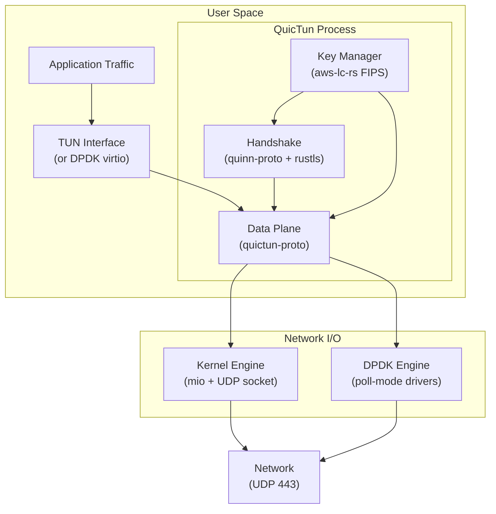
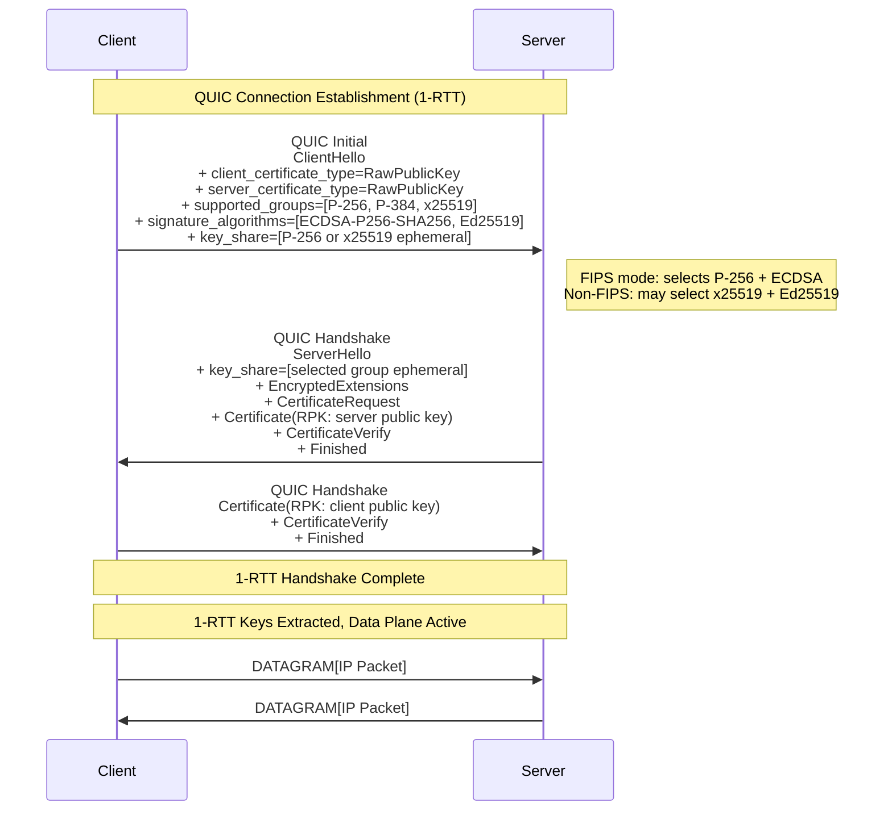
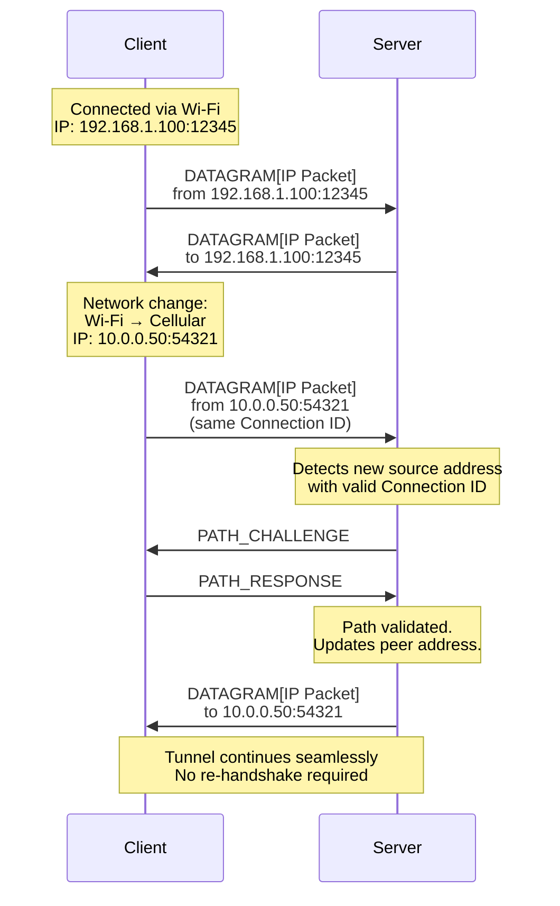
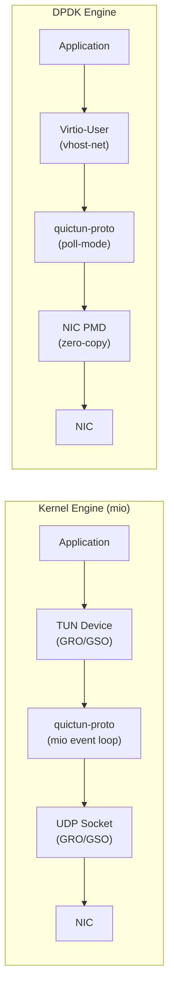

# QuicTun: A QUIC-Based Secure Tunnel Primitive Built on RFC-Standardized Protocols

**Authors:** SeongUk Cho

**Date:** March 2026

**Version:** 2.0

---

## Abstract

WireGuard established a new standard for VPN simplicity, but its design choices — the Noise protocol framework with Curve25519, ChaCha20-Poly1305, and BLAKE2s — create barriers in environments requiring FIPS 140-3 compliance. Its fixed UDP port is trivially blocked by restrictive firewalls, and it lacks native support for connection migration.

We present **QuicTun**, a secure tunnel primitive that uses a **two-phase protocol design**: standard QUIC (RFC 9000) and TLS 1.3 (RFC 8446) for connection establishment, then a purpose-built 1-RTT data plane for steady-state packet forwarding. This split eliminates QUIC's stream state machine, congestion control, and loss detection from the hot path while retaining the full security guarantees of the TLS 1.3 handshake. Raw Public Keys (RFC 7250) provide WireGuard-style identity management without X.509 certificate infrastructure. Like WireGuard, QuicTun is a point-to-point tunnel — it creates a secure, encrypted link between two peers. What operators build on top of it (site-to-site VPN, remote access gateway, mesh overlay, multi-hop relay) is an application-layer concern, not a protocol concern.

Our per-packet overhead analysis demonstrates that QuicTun with zero-length Connection IDs achieves a **20-byte overhead** per tunneled packet with variable packet number encoding — 37.5% less than WireGuard's 32-byte overhead — while operating over a fully RFC-standardized protocol stack. A fixed 4-byte packet number mode (23-byte overhead) enables lock-free parallel encryption across CPU cores. Because QuicTun's entire cryptographic layer delegates to aws-lc-rs (FIPS 140-3 Certificate #4631), deployments requiring FIPS compliance can enable it through configuration rather than architectural changes. QuicTun operates on UDP port 443, making it indistinguishable from standard QUIC/HTTP3 traffic to network middleboxes and DPI systems.

---

## 1. Introduction

### 1.1 The Problem

Encrypted tunnels are a foundational network primitive. The design space spans personal VPNs, site-to-site links, service mesh encryption, and enterprise remote access. Despite this diversity, most deployments share common requirements:

1. **Standards-based cryptography** — RFC-standardized, widely audited protocols reduce risk and enable regulatory compliance (FIPS 140-3) when needed.
2. **Network traversal** — Firewalls, hotel networks, and restrictive enterprise environments increasingly block non-standard UDP traffic, requiring tunnels that blend with legitimate web traffic.
3. **Mobile continuity** — Devices roam between Wi-Fi, cellular, and wired networks, requiring seamless connection migration without session re-establishment.

Legacy solutions (IPsec/IKEv2, OpenVPN) use standardized cryptography but suffer from protocol complexity and poor performance. WireGuard delivers simplicity and speed but uses non-standard cryptographic primitives, a fixed protocol fingerprint, and lacks connection migration.

### 1.2 WireGuard's Limitations

WireGuard [Donenfeld 2017] is widely recognized for its minimal attack surface (~4,000 lines of kernel code) and cryptographic elegance. However, its design choices create fundamental barriers to enterprise adoption:

- **Non-FIPS cryptography.** WireGuard's Noise_IKpsk2 handshake uses Curve25519, ChaCha20-Poly1305, BLAKE2s, and SipHash — none of which appear on the FIPS 140-3 approved algorithm list. Red Hat explicitly documents that "WireGuard is not FIPS-compliant" and disables it in FIPS mode [Red Hat 2024].
- **Fixed protocol fingerprint.** WireGuard uses a distinctive 4-byte message type header (0x01–0x04) that is trivially identified by DPI systems. Its fixed UDP port (default 51820) is commonly blocked by enterprise firewalls.
- **No connection migration.** WireGuard binds sessions to source IP:port tuples. Network transitions require full handshake re-establishment, causing visible latency for mobile users.
- **No congestion control.** WireGuard is a Layer 3 tunnel that passes packets without rate adaptation, relying entirely on inner-protocol congestion control. This can cause bufferbloat and unfairness in shared network environments.

### 1.3 Contributions

This paper makes the following contributions:

1. **Two-phase protocol architecture.** We present QuicTun, a tunnel primitive that uses standard QUIC for connection establishment and a purpose-built 1-RTT data plane for steady-state forwarding. The data plane uses QUIC DATAGRAM frames (RFC 9221) with the same wire format and AEAD encryption as standard QUIC short header packets, but eliminates streams, congestion control, and loss detection from the hot path.
2. **Overhead analysis.** We provide a byte-level comparison showing QuicTun achieves 20-byte per-packet overhead (with zero-length CIDs and variable packet numbers), compared to WireGuard's 32 bytes. A fixed 4-byte packet number mode (23 bytes overhead) enables lock-free parallel encryption.
3. **FIPS-ready cryptography.** We describe a cryptographic architecture that delegates all primitives to aws-lc-rs (FIPS 140-3 Certificate #4631), enabling FIPS-compliant operation through a configuration flag without architectural changes.
4. **Firewall traversal.** We demonstrate that QuicTun on UDP 443 is protocol-indistinguishable from standard HTTP/3 traffic to passive DPI systems.
5. **Performance tiers.** We present a two-tier data-plane architecture — a kernel engine using synchronous I/O with GRO/GSO offloads, and a DPDK kernel-bypass engine — enabling deployment from edge nodes to data center gateways. The DPDK tier includes a router mode for dedicated gateway appliances with NAT and multi-core pipeline support.

---

## 2. Background and Related Work

### 2.1 QUIC Protocol Suite

QUIC is a UDP-based, multiplexed transport protocol standardized by the IETF in 2021. The core specification spans four RFCs, all at Proposed Standard status:

- **RFC 9000** — QUIC: A UDP-Based Multiplexed and Secure Transport. Defines connection establishment, stream multiplexing, flow control, and connection migration.
- **RFC 9001** — Using TLS to Secure QUIC. Mandates TLS 1.3 as the handshake protocol, integrating encryption at the transport layer rather than as a separate session layer.
- **RFC 9002** — QUIC Loss Detection and Congestion Control. Specifies the loss recovery and congestion control algorithms, defaulting to a variant of NewReno with provisions for alternative algorithms (e.g., CUBIC, BBR).
- **RFC 9221** — An Unreliable Datagram Extension to QUIC. Extends QUIC with unreliable DATAGRAM frames, enabling applications to send data without stream-level reliability — ideal for VPN tunneling where inner protocols handle their own retransmission.

QUIC's design is particularly well-suited for VPN tunneling because it provides:

- **Mandatory encryption** via TLS 1.3, eliminating the need for a separate cryptographic layer
- **Connection migration** via Connection IDs that decouple sessions from network addresses
- **Built-in congestion control** preventing the tunnel from overwhelming the network path
- **Multiplexing** allowing control and data channels to share a single UDP 4-tuple
- **1-RTT handshake** (0-RTT for resumption), minimizing connection setup latency

### 2.2 WireGuard

WireGuard [Donenfeld 2017] established a new benchmark for VPN simplicity. Its key design choices include:

- **Noise_IKpsk2 handshake** — A two-message handshake providing mutual authentication, forward secrecy, and identity hiding using static Curve25519 keys.
- **Cryptokey routing** — A routing table that maps allowed IP ranges to peer public keys, merging routing and access control into a single primitive.
- **Minimal state machine** — No session negotiation, no cipher agility, no version negotiation. The protocol has exactly four message types.

These choices produce an exceptionally clean protocol but preclude FIPS compliance, cipher agility, and connection migration. Recent work [Yuce 2025] demonstrated that replacing ChaCha20 with AES-GCM in WireGuard yields 11–19% throughput gains on AES-NI hardware, but required modifying WireGuard's source code since the protocol has no cipher negotiation mechanism — both peers must be manually configured to use the same cipher.

### 2.3 MASQUE and Industry Adoption

MASQUE (Multiplexed Application Substrate over QUIC Encryption) defines mechanisms for proxying UDP (RFC 9298) and IP (RFC 9484) traffic over HTTP/3 CONNECT methods. Several major deployments signal industry convergence toward QUIC-based tunneling:

- **Cloudflare WARP** is migrating from WireGuard to a MASQUE-based architecture, citing connection migration and firewall traversal as primary motivations [Cloudflare 2024].
- **Mullvad VPN** uses MASQUE as an obfuscation layer to wrap WireGuard traffic in QUIC, enabling traversal of networks that block raw WireGuard [Mullvad 2024].
- **Cisco** has integrated MASQUE-based tunneling into its secure access service edge (SASE) products [Cisco 2024].

QuicTun differs from MASQUE-based approaches by operating at Layer 3 directly over QUIC datagrams rather than proxying through HTTP/3, eliminating the HTTP framing overhead and complexity.

### 2.4 Existing QUIC-Based VPNs

Several projects have explored QUIC for VPN tunneling:

- **TUIC** — A proxy protocol using QUIC streams for TCP proxying and datagrams for UDP, focused on censorship circumvention rather than enterprise VPN.
- **Hysteria** — A censorship-resistant proxy built on a modified QUIC implementation (quic-go) with custom congestion control (Brutal), optimized for lossy networks.
- **oVPN over QUIC** — OpenVPN's experimental QUIC transport, which layers the existing OpenVPN protocol over QUIC streams, inheriting OpenVPN's significant per-packet overhead.

None of these projects provide the zero-overhead datagram tunneling or FIPS-ready cryptographic architecture that QuicTun achieves.

### 2.5 FIPS 140-3

FIPS 140-3 (Federal Information Processing Standard) specifies security requirements for cryptographic modules used within federal information systems. Key requirements include:

- **Approved algorithms only** — AES-128/256-GCM, SHA-256/384/512, ECDHE (P-256/P-384), ECDSA, RSA (2048+)
- **Module boundary** — A defined cryptographic boundary encapsulating all key material and cryptographic operations
- **Self-tests** — Power-on self-tests (POST) and conditional self-tests for algorithm validation
- **Key management** — Secure key generation, storage, zeroization, and lifecycle management

WireGuard's primitives — Curve25519, ChaCha20-Poly1305, BLAKE2s — are not FIPS-approved. While ChaCha20-Poly1305 is under consideration, Curve25519 and BLAKE2s remain outside the approved list as of 2026.

### Table 1: VPN Feature Comparison Matrix

| Feature | WireGuard | IPsec/IKEv2 | OpenVPN | MASQUE | **QuicTun** |
|---|---|---|---|---|---|
| FIPS 140-3 ready | No | Yes | Yes | Yes | **Yes** |
| Connection migration | No | IKEv2 MOBIKE | No | Yes | **Yes** |
| Congestion control | No | No | No | Yes | **Optional (pluggable)** |
| Firewall traversal (443) | No | UDP 500/4500 | TCP 443 | Yes | **Yes** |
| 1-RTT handshake | Yes (1-RTT) | 2-RTT | 2+ RTT | 1-RTT | **1-RTT** |
| Per-packet overhead | 32 B | 50–73 B | 46–69 B | 29+ B | **20 B** |
| DPI resistance | Low | Low | Medium | High | **High** |
| RFC standardized transport | No | Yes | No | Yes | **Yes** |
| Kernel-bypass data path | Yes | Yes | No | No | **Yes (DPDK)** |
| Path MTU discovery | ICMP-based | ICMP-based | ICMP-based | DPLPMTUD | **DPLPMTUD** |
| Code complexity | ~4K LoC | ~100K+ LoC | ~100K+ LoC | Varies | **~15K LoC** |

---

## 3. Design Goals and Threat Model

### 3.1 Design Goals

QuicTun is designed to satisfy the following goals:

1. **FIPS-ready cryptographic architecture.** All cryptographic operations are delegated to a library with an existing FIPS 140-3 validation (aws-lc-rs). Enabling FIPS-compliant mode should require only a configuration change, not an architectural one.

2. **Minimal per-packet overhead.** The tunnel must add no more overhead than WireGuard per tunneled packet, preserving effective MTU for inner protocols.

3. **Firewall and DPI traversal.** The tunnel must operate on UDP port 443 and be indistinguishable from standard HTTP/3 traffic to passive deep packet inspection systems.

4. **Seamless connection migration.** Network transitions (Wi-Fi to cellular, DHCP renewal, NAT rebinding) must complete without visible interruption to tunneled sessions.

5. **Congestion-aware transport.** The tunnel must implement RFC-compliant congestion control to prevent bufferbloat and ensure fair coexistence with other traffic.

6. **Simple identity model.** Authentication must use static public keys (as in WireGuard) without requiring X.509 certificate infrastructure, while remaining compatible with enterprise PKI when needed.

7. **Scalable performance.** The architecture must support deployment from single-user endpoints (1–5 Gbps) to data center gateways (25–100 Gbps) through tiered data-plane implementations.

### 3.2 Threat Model

QuicTun assumes the following threat model:

**In scope:**
- Passive eavesdroppers on any network segment between peers
- Active network attackers capable of injecting, modifying, or replaying packets
- Deep packet inspection systems attempting to identify and block VPN traffic
- Compromised network infrastructure (rogue DHCP, DNS, ARP)
- Denial-of-service attacks against the tunnel endpoint

**Trust assumptions:**
- Endpoint devices are not compromised (kernel, hardware)
- The FIPS-validated cryptographic module (aws-lc-rs) is correctly implemented
- Peer public keys are distributed through a trusted out-of-band channel
- The operating system's random number generator is properly seeded

### 3.3 Scope and Non-Goals

QuicTun is a **tunnel primitive** — a secure, encrypted point-to-point link between two peers. Like WireGuard, it deliberately does not prescribe topology. Site-to-site VPN, remote access gateway, mesh overlay (analogous to Tailscale over WireGuard), and multi-hop relay are all valid compositions of QuicTun tunnels, built at the application or orchestration layer. The tunnel itself is topology-agnostic.

The following are explicitly out of scope for the tunnel primitive:

- **Anonymity.** QuicTun is not a Tor replacement. Traffic analysis resistance is not a design goal.
- **Censorship circumvention.** While QuicTun resists casual DPI, it does not implement active probing countermeasures designed for adversarial censorship environments (e.g., China's GFW).
- **Application-layer proxying.** QuicTun operates at Layer 3 (IP tunneling), not as an HTTP/SOCKS proxy.

---

## 4. Architecture Overview

### 4.1 System Architecture

QuicTun is a point-to-point tunnel primitive with a **two-phase, data-plane-only** architecture. Connection establishment uses standard QUIC (quinn-proto) for the TLS 1.3 handshake. Once 1-RTT keys are established, the data plane switches to **quictun-proto** — a purpose-built 1-RTT implementation that processes only DATAGRAM, ACK, PING, and CONNECTION_CLOSE frames. This eliminates QUIC's stream state machine, flow control, loss detection, and congestion control from the forwarding path. Management and configuration are handled out-of-band (static configuration, local CLI), following WireGuard's proven model of zero in-band control plane.

This separation provides security benefits: the data path parses only four frame types — no stream reassembly, no flow control complexity, no stream-related attack surface. The handshake path uses the full QUIC state machine but runs only at connection setup (milliseconds). Configuration changes require local OS-level access (CLI), never over the wire.

**Figure 1: System Architecture**



### 4.2 Management (Out-of-Band)

Following WireGuard's design philosophy, QuicTun has **no in-band control plane**. All management is local and out-of-band:

- **Peer configuration** — Static `tunnel.toml` loaded at startup (IP assignment, allowed-IPs, MTU, peers)
- **Runtime management** — Local CLI (`quictun up/down`) and future Unix socket API for daemon mode
- **Keepalive** — PING frames in the data path (no separate signaling)
- **Key rotation** — Automatic via TLS 1.3 key_phase bit with pre-computed key generations; exhaustion triggers full rehandshake via quinn-proto
- **Graceful shutdown** — CONNECTION_CLOSE frame in the data path

**Security rationale:** Separating management from the data path ensures that an attacker who can influence tunnel traffic (inner IP packets) cannot reach management logic. The data path parses only DATAGRAM/ACK/PING/CONNECTION_CLOSE frames — no stream reassembly, no flow control state, minimal attack surface.

### 4.3 Data Plane

QuicTun uses a **two-phase data plane**. During connection establishment, the standard QUIC stack (quinn-proto) handles the TLS 1.3 handshake. Once 1-RTT keys are extracted, a purpose-built data plane (quictun-proto) takes over for all steady-state packet forwarding.

**Phase 1: Handshake (quinn-proto).** Standard QUIC Initial and Handshake packets carry the TLS 1.3 key exchange with RPK authentication. This phase uses the full QUIC state machine and runs only at connection setup.

**Phase 2: Data forwarding (quictun-proto).** After 1-RTT keys are established, quictun-proto processes packets using the same QUIC short header wire format (RFC 9000) and AEAD encryption (RFC 9001). It implements:
- **DATAGRAM frames** (RFC 9221) — each carries a single tunneled IP packet
- **ACK frames** — timer-driven, for peer liveness and key update confirmation
- **PING frames** — keepalive
- **CONNECTION_CLOSE** — graceful shutdown
- **Key update** — via key_phase bit rotation with pre-computed key generations
- **Replay protection** — sliding-window bitmap (65536 packet numbers)

**Intentionally excluded from the data plane:** streams, flow control, loss detection, retransmission, and congestion control. These are unnecessary for a DATAGRAM-only tunnel where inner protocols (TCP) handle their own reliability and rate adaptation.

**Design rationale:** A general-purpose QUIC implementation allocates significant CPU to state that a tunnel never uses — stream reassembly buffers, per-stream flow control windows, loss detection timers, and congestion window calculations. Profiling of an earlier full-QUIC design showed the QUIC state machine consuming ~19% of CPU at line rate. The two-phase design eliminates this overhead while preserving the security properties of the TLS 1.3 handshake.

Key properties of the data plane:

- **Unreliable delivery** — Lost datagrams are not retransmitted, avoiding head-of-line blocking and allowing inner-protocol congestion control to operate correctly.
- **Minimal framing** — A DATAGRAM frame adds only a type byte and length field, contributing to QuicTun's low per-packet overhead.
- **Wire-compatible** — Data-plane packets are valid QUIC short header packets. Middleboxes, load balancers, and QUIC-aware firewalls handle them identically to standard QUIC traffic.

### 4.4 Connection Lifecycle

```
1. Client sends QUIC Initial (ClientHello with RPK)          ← quinn-proto
2. Server responds with Handshake (ServerHello with RPK)      ← quinn-proto
3. TLS 1.3 handshake completes, 1-RTT keys extracted          ← quinn-proto
4. Data plane switches to quictun-proto                        ← handoff
5. IP packets sent as DATAGRAM frames in QUIC short headers    ← quictun-proto
6. Key rotation via key_phase bit at volume threshold          ← quictun-proto
7. Shutdown via CONNECTION_CLOSE or idle timeout               ← quictun-proto
```

The handoff at step 4 is the critical design point. quinn-proto provides the full QUIC state machine for secure connection establishment; quictun-proto provides a minimal, high-performance forwarding engine for the lifetime of the tunnel. Packet routing between the two phases uses the QUIC header form bit: long header (bit 7 = 1) routes to quinn-proto for handshake processing; short header (bit 7 = 0) routes to quictun-proto for data forwarding.

---

## 5. Protocol Design

### 5.1 Handshake Sequence

QuicTun uses TLS 1.3 with Raw Public Keys (RFC 7250) for authentication. RPK provides WireGuard-style identity semantics — peers are identified by their public keys — without the complexity and attack surface of X.509 certificate parsing.

**Figure 2: Handshake Sequence with RPK Authentication**



### 5.2 Raw Public Key Authentication

TLS 1.3 with RPK (RFC 7250) enables a WireGuard-like identity model:

- **No Certificate Authority.** Peers authenticate each other directly by public key, not by certificate chain.
- **Minimal parsing surface.** RPK certificates contain only a SubjectPublicKeyInfo structure — no names, extensions, or validity periods to parse.
- **Key pinning.** The server maintains an allowlist of authorized client public keys, analogous to WireGuard's `[Peer]` configuration.
- **PKI compatible.** For enterprises requiring certificate infrastructure, QuicTun can fall back to standard X.509 certificates without protocol changes — TLS 1.3 negotiates the certificate type during handshake.

The RPK is encoded as a DER-serialized SubjectPublicKeyInfo:

```
SubjectPublicKeyInfo ::= SEQUENCE {
    algorithm   AlgorithmIdentifier,  -- e.g., id-ecPublicKey + secp256r1
    subjectPublicKey  BIT STRING      -- the raw public key
}
```

For ECDSA P-256, this encoding is 91 bytes — compared to a typical X.509 certificate at 800–1500 bytes.

### 5.3 Packet Format Comparison

**Figure 3: Packet Format Comparison — QuicTun vs WireGuard**

```
QuicTun Packet (CID Length = 0):
┌──────────────────────────────────────────────────────────────┐
│ UDP Header (8 bytes)                                         │
├──────────────────────────────────────────────────────────────┤
│ QUIC Short Header:                                           │
│   ┌─────────────────────────────────────────────────────────┐│
│   │ Header Form (1b) | Fixed Bit (1b) | Spin (1b) |        ││
│   │ Reserved (2b) | Key Phase (1b) | Pkt Num Len (2b)      ││
│   │ = 1 byte total flags                                    ││
│   ├─────────────────────────────────────────────────────────┤│
│   │ Destination Connection ID (0 bytes when CID=0)          ││
│   ├─────────────────────────────────────────────────────────┤│
│   │ Packet Number (1–4 bytes, typically 1–2)                ││
│   └─────────────────────────────────────────────────────────┘│
├──────────────────────────────────────────────────────────────┤
│ QUIC DATAGRAM Frame:                                         │
│   ┌─────────────────────────────────────────────────────────┐│
│   │ Frame Type 0x31 (1 byte) — DATAGRAM with length         ││
│   ├─────────────────────────────────────────────────────────┤│
│   │ Length (1–2 bytes, varint)                               ││
│   └─────────────────────────────────────────────────────────┘│
├──────────────────────────────────────────────────────────────┤
│ Payload: Tunneled IP Packet                                  │
├──────────────────────────────────────────────────────────────┤
│ AEAD Tag (16 bytes — AES-128-GCM / AES-256-GCM)             │
└──────────────────────────────────────────────────────────────┘

Total overhead: 8 (UDP) + 1 (flags) + 0 (CID) + 1 (pkt num)
              + 1 (frame type) + 1 (length) + 16 (AEAD)
              = 28 bytes minimum
Non-UDP overhead: 20 bytes

WireGuard Data Packet:
┌──────────────────────────────────────────────────────────────┐
│ UDP Header (8 bytes)                                         │
├──────────────────────────────────────────────────────────────┤
│ WireGuard Header:                                            │
│   ┌─────────────────────────────────────────────────────────┐│
│   │ Type (4 bytes) — always 0x04000000 for data             ││
│   ├─────────────────────────────────────────────────────────┤│
│   │ Receiver Index (4 bytes) — session identifier           ││
│   ├─────────────────────────────────────────────────────────┤│
│   │ Counter (8 bytes) — nonce / anti-replay                 ││
│   └─────────────────────────────────────────────────────────┘│
├──────────────────────────────────────────────────────────────┤
│ Payload: Tunneled IP Packet (encrypted)                      │
├──────────────────────────────────────────────────────────────┤
│ Poly1305 Tag (16 bytes)                                      │
└──────────────────────────────────────────────────────────────┘

Total overhead: 8 (UDP) + 4 (type) + 4 (receiver) + 8 (counter)
              + 16 (Poly1305)
              = 40 bytes
Non-UDP overhead: 32 bytes
```

### 5.4 Per-Packet Overhead Analysis

The per-packet overhead is the central quantitative contribution of this paper. Both QuicTun and WireGuard share the 8-byte UDP header and a 16-byte AEAD authentication tag. The difference lies in the protocol headers between UDP and the encrypted payload.

**Figure 4: Per-Packet Overhead Comparison (excluding UDP header)**

```
           Per-Packet Overhead (bytes, excluding 8-byte UDP header)

    QuicTun   ████████████████████  20 bytes
    (CID=0)   [F][PN][FT][L][--------AEAD Tag--------]
              1   1   1   1          16

    QuicTun   ████████████████████████  24 bytes
    (CID=4)   [F][CID-][PN][FT][L][--------AEAD Tag--------]
              1    4    1   1   1          16

    QuicTun   ████████████████████████████  28 bytes
    (CID=8)   [F][CID------][PN][FT][L][--------AEAD Tag--------]
              1       8      1   1   1          16

    WireGuard ████████████████████████████████  32 bytes
              [--Type--][--Recv--][---Counter---][--------AEAD Tag--------]
                  4         4          8                  16

    IPsec     ██████████████████████████████████████████████████  50 bytes (min)
    (ESP)     [SPI][Seq][----IV----][Pad][PL][NH][--------AEAD Tag--------]
               4    4       8       1+   1   1           16

    OpenVPN   ██████████████████████████████████████████████████████  54 bytes (min)
              [Op][SID------][PN--][---HMAC/Tag---][----IV----]
              1       8       4         20             16

    Legend: F=Flags, PN=Packet Number, FT=Frame Type,
            L=Length, CID=Connection ID
```

### Table 2: Per-Packet Overhead Breakdown

| Component | QuicTun (CID=0) | QuicTun (CID=4) | QuicTun (CID=8) | WireGuard |
|---|---|---|---|---|
| QUIC flags byte | 1 | 1 | 1 | — |
| Connection ID | 0 | 4 | 8 | — |
| Packet number | 1 | 1 | 1 | — |
| DATAGRAM frame type | 1 | 1 | 1 | — |
| DATAGRAM length (varint) | 1 | 1 | 1 | — |
| WG message type | — | — | — | 4 |
| WG receiver index | — | — | — | 4 |
| WG counter (nonce) | — | — | — | 8 |
| AEAD tag | 16 | 16 | 16 | 16 |
| **Total (excl. UDP)** | **20** | **24** | **28** | **32** |
| **Total (incl. UDP)** | **28** | **32** | **36** | **40** |
| **Overhead vs WireGuard** | **-37.5%** | **-25.0%** | **-12.5%** | **baseline** |

**Key insight:** WireGuard uses a 4-byte message type field (of which only values 1–4 are defined), a 4-byte receiver index, and an 8-byte counter — totaling 16 bytes of protocol header. QuicTun's QUIC short header with zero-length CID requires only 4 bytes (1 flags + 1 packet number + 1 frame type + 1 length), yielding a 12-byte saving per packet.

The AEAD tag is identical in both protocols (16 bytes): AES-GCM and ChaCha20-Poly1305 both produce 16-byte tags.

### 5.4.1 Fixed 4-Byte Packet Number Mode

Standard QUIC uses 1–4 byte variable packet number encoding, where the encoder selects the shortest representation based on `largest_acked`. This creates a TX→RX state dependency: the encoder must know the latest ACK state to choose the encoding length. This dependency prevents lock-free parallel encryption across CPU cores.

QuicTun's data plane offers a **fixed 4-byte packet number** mode: the encoder needs only an atomic counter, no ACK state. This enables:

- **Lock-free parallel encrypt** — Multiple CPU cores can encrypt packets concurrently without synchronization on ACK state.
- **Zero-copy mbuf alignment** — QUIC header (1 flags + 0 CID + 4 PN = 5 bytes) + DATAGRAM frame (1 type + 1 length = 2 bytes) = 7 bytes. With header protection sample offset, this preserves efficient memory alignment for DMA-based packet I/O.
- **Stateless encoding** — The packet number encoder is a single atomic increment, eliminating a class of concurrency bugs.

The cost is 3 extra bytes per packet compared to the 1-byte minimum (23 vs 20 bytes overhead with CID=0). In practice, variable encoding would reach 3–4 bytes within ~47ms at line rate, so the cost applies only to the first fraction of a connection's lifetime. For long-lived tunnels, the amortized overhead difference is negligible.

### Table 2a: Overhead with Fixed 4-Byte Packet Number (CID=0)

| Component | Variable PN (min) | Fixed 4-Byte PN |
|---|---|---|
| QUIC flags byte | 1 | 1 |
| Connection ID | 0 | 0 |
| Packet number | 1 | 4 |
| DATAGRAM frame type | 1 | 1 |
| DATAGRAM length (varint) | 1 | 1 |
| AEAD tag | 16 | 16 |
| **Total (excl. UDP)** | **20** | **23** |
| **Overhead vs WireGuard** | **-37.5%** | **-28.1%** |

### 5.5 Connection ID Tradeoffs

QUIC Connection IDs (CIDs) enable connection migration by providing a session identifier that is independent of the network 5-tuple. The CID length directly impacts per-packet overhead.

### Table 3: CID Length Tradeoffs

| CID Length | Overhead (excl. UDP) | Migration Support | Security Properties | Recommended Use |
|---|---|---|---|---|
| 0 bytes | 20 B | None — session bound to 5-tuple | No linkability protection | Point-to-point, stable networks |
| 4 bytes | 24 B | Basic migration | 2^32 CID space; sufficient for most deployments | General enterprise use |
| 8 bytes | 28 B | Full migration + rotation | 2^64 CID space; unlinkable rotation | Mobile clients, high-security |
| 16 bytes | 36 B | Full migration + rotation | 2^128 CID space | Maximum unlinkability (rarely needed) |

QuicTun defaults to **4-byte CIDs**, providing connection migration with only 4 bytes additional overhead compared to the zero-CID optimum. For deployments where connection migration is not needed (e.g., site-to-site links), zero-length CIDs reduce overhead to 20 bytes per packet.

### 5.6 Connection Migration

QUIC's connection migration (RFC 9000, Section 9) enables QuicTun to seamlessly handle network transitions:

**Figure 5: Connection Migration Flow**



Migration completes within a single RTT (PATH_CHALLENGE + PATH_RESPONSE), with no cryptographic re-establishment. TLS session keys, tunnel IP assignment, and routing configuration all persist across the migration.

**Note:** Connection migration requires non-zero Connection IDs (CID > 0) so that the server can associate packets from the new address with the existing session. With zero-length CIDs, sessions are bound to the 5-tuple. Deployments requiring migration should configure CID length ≥ 4.

### 5.7 Congestion Control

QuicTun's data plane (quictun-proto) is **DATAGRAM-only and does not retransmit lost packets**. This design interacts with congestion control differently than a stream-based QUIC connection.

**The double-CC problem.** Inner TCP connections running through the tunnel perform their own congestion control. Adding a second congestion controller at the tunnel layer creates complex interactions: the outer CC may throttle the tunnel below the capacity that inner TCP has probed, or inner TCP may misinterpret outer CC-induced drops as path congestion. These interactions are well-documented in the tunneling literature and are a primary reason WireGuard deliberately omits congestion control.

**QuicTun's approach.** The data plane treats congestion control as **optional and pluggable** rather than mandatory:

- **Default: no outer CC.** For point-to-point tunnels on dedicated or well-provisioned links, the data plane forwards datagrams without rate limiting. Inner TCP handles congestion adaptation end-to-end. This matches WireGuard's behavior and avoids double-CC pathology.
- **Optional: delay-based CC.** For shared network paths where fair coexistence matters, a delay-based congestion controller can be enabled. Delay-based CC (rather than loss-based) is preferred because it can detect queuing before packet loss occurs, reducing interference with inner TCP's loss-based signals.

This pluggable design acknowledges that the optimal CC strategy depends on the deployment: dedicated site-to-site links benefit from no outer CC, while shared WAN paths may benefit from tunnel-level pacing.

**Comparison with WireGuard:** WireGuard has no congestion control and no mechanism to add it. QuicTun's architecture supports CC as an optional layer without protocol changes, giving operators the choice rather than making it for them.

### 5.8 Path MTU Discovery

QUIC incorporates Datagram Packetization Layer PMTU Discovery (DPLPMTUD, RFC 8899), which discovers the path MTU without relying on ICMP "Fragmentation Needed" messages. This is a significant operational advantage over WireGuard, which relies on the operating system's standard PMTUD mechanism.

Traditional PMTUD depends on ICMP messages that are frequently blocked by firewalls, middleboxes, and security appliances. When ICMP is filtered, PMTUD fails silently, causing either black-holed packets (too large, silently dropped) or suboptimal MTU (too conservative, wasting bandwidth). This is a common operational problem known as "PMTUD black hole."

QUIC's DPLPMTUD probes the path by sending progressively larger packets and observing which are acknowledged. It does not rely on any ICMP feedback:

1. Start with a baseline MTU (1200 bytes, the QUIC minimum)
2. Send probe packets at increasing sizes
3. If a probe is acknowledged, the MTU can be raised
4. If a probe is lost, the current MTU is maintained

This allows QuicTun to automatically discover and use the optimal MTU on any network path, including paths where ICMP is blocked — a scenario that causes persistent problems for WireGuard deployments behind restrictive firewalls.

---

## 6. Cryptographic Design

### 6.1 Cipher Suite Selection

QuicTun negotiates cipher suites via TLS 1.3's standard mechanism. By default, both FIPS-approved and non-FIPS cipher suites are available. When `fips_mode = true` is set, QuicTun restricts negotiation to FIPS-approved combinations only.

### Table 4: Cryptographic Algorithm Comparison

| Function | QuicTun (FIPS mode) | QuicTun (default mode) | WireGuard |
|---|---|---|---|
| Key exchange | ECDHE P-256 / P-384 | ECDHE P-256 / P-384 / x25519 | Curve25519 |
| Authentication | ECDSA P-256 / P-384 | ECDSA P-256 / Ed25519 | Curve25519 (static) |
| Symmetric cipher | AES-128-GCM / AES-256-GCM | AES-128-GCM / AES-256-GCM / ChaCha20-Poly1305 | ChaCha20-Poly1305 |
| Hash / KDF | SHA-256 / SHA-384 (HKDF) | SHA-256 / SHA-384 (HKDF) | BLAKE2s (HMAC) |
| MAC | GMAC (via AES-GCM) | GMAC or Poly1305 (via AEAD) | Poly1305 |
| FIPS 140-3 | All approved | Mix of approved and non-approved | None approved |

In default mode, TLS 1.3 negotiates the optimal cipher suite for the connection. Devices with hardware AES (AES-NI, ARMv8-CE) typically prefer AES-GCM for performance; devices without hardware AES prefer ChaCha20-Poly1305 for constant-time software execution. In FIPS mode, only FIPS-approved algorithms are permitted, and non-approved options (x25519, Ed25519, ChaCha20-Poly1305) are disabled.

### 6.2 FIPS Module Boundary

QuicTun delegates all cryptographic operations to **aws-lc-rs**, the Rust wrapper around AWS-LC (AWS Libcrypto). AWS-LC holds FIPS 140-3 Certificate #4631 (Security Level 1), validated by an accredited NIST CMVP laboratory. This design choice means QuicTun does not need to implement or certify its own cryptographic module — it inherits FIPS readiness from the underlying library.

### Table 5: FIPS 140-3 Compliance Matrix

| Component | Role | FIPS Module | Validation |
|---|---|---|---|
| aws-lc-rs | Cryptographic primitives | AWS-LC | Certificate #4631 |
| rustls | TLS 1.3 protocol engine | Delegates to aws-lc-rs | — (protocol logic only) |
| quinn | QUIC protocol engine | Delegates to rustls | — (protocol logic only) |
| QuicTun | Tunnel application | No cryptographic operations | — |

The FIPS module boundary is cleanly defined:

- **Inside the boundary (aws-lc-rs / AWS-LC):** AES-GCM encryption/decryption, ECDHE key generation and agreement, ECDSA signing/verification, HKDF key derivation, SHA-2 hashing, DRBG random number generation, key zeroization.
- **Outside the boundary (rustls, quinn, QuicTun):** Protocol state machines, packet framing, stream multiplexing, congestion control, connection migration, configuration management.

This separation ensures that QuicTun's protocol logic — which evolves frequently — does not affect the validated cryptographic module.

### 6.3 Key Derivation and Rotation

TLS 1.3 provides automatic key updates through the `KeyUpdate` handshake message (RFC 8446, Section 4.6.3). QuicTun leverages this mechanism for periodic key rotation:

1. **Initial keys** — Derived during the TLS 1.3 handshake via HKDF-Expand-Label from the handshake secret.
2. **Application keys** — Derived from the master secret, separate for client→server and server→client directions.
3. **Key updates** — Either peer can initiate a key update, deriving new application traffic secrets from the current ones: `application_traffic_secret_N+1 = HKDF-Expand-Label(application_traffic_secret_N, "traffic upd", "", Hash.length)`.

Key rotation is triggered by:
- **Volume threshold** — After encrypting 2^23 packets with a single key (conservative limit for AES-GCM, well below the 2^32 safety bound)
- **Time threshold** — Every 2 hours, whichever comes first

All key material is stored within the aws-lc-rs module boundary and zeroized on deallocation.

---

## 7. Performance Architecture

QuicTun provides two data-plane tiers, enabling deployment across the performance spectrum from edge devices to data center gateways.

### 7.0 Empirical Context: Where the Bottleneck Actually Is

Recent empirical work provides critical context for VPN performance. Yuce et al. [Yuce 2025] modified WireGuard to support AES-GCM with AES-NI and measured performance across kernel and user-space implementations. Their key findings:

1. **Encryption accounts for only ~7% of CPU time.** Flame graph analysis shows the kernel networking stack (conntrack, netfilter, routing) dominates processing. Encryption is not the bottleneck.

2. **AES-GCM with AES-NI outperforms ChaCha20-Poly1305** by 11% in kernel mode and 19.5% in user-space, with 2.2% lower CPU usage and 5.5% fewer TCP retransmissions.

3. **User-space implementations achieve competitive throughput.** BoringTun (user-space WireGuard in Rust) with AES-GCM achieved ~17.6 Gbps on a 4-core Intel i7 (~4.4 Gbps per core).

4. **User-space can outperform kernel in multi-core scenarios** due to better thread scheduling and memory locality control, avoiding kernel spinlocks and softIRQ bottlenecks.

5. **WireGuard's lack of cipher negotiation is a practical limitation.** Their AES implementation requires both peers to use the same cipher, with no way to negotiate. They identify dynamic cipher selection as "promising future work."

These findings validate QuicTun's design choices: TLS 1.3 provides the cipher negotiation WireGuard lacks, AES-GCM is the faster cipher on AES-NI hardware, and user-space implementations with kernel bypass are the established path to high throughput. Since encryption is only ~7% of processing time, the dominant bottleneck in any VPN is **packet I/O** — the cost of moving packets between the NIC, kernel, and user space. QuicTun's two-tier architecture addresses this directly: the kernel engine minimizes I/O overhead via GRO/GSO batching; the DPDK engine eliminates kernel involvement entirely. The two-phase protocol design (Section 4.3) further reduces CPU overhead by eliminating the QUIC state machine from the hot path — profiling of a full-QUIC design showed ~19% CPU spent in protocol state management, which quictun-proto eliminates.

### Table 6: Performance Tier Characteristics

| Tier | Mechanism | Throughput Range | Use Case |
|---|---|---|---|
| **Kernel Engine** | Synchronous mio event loop, TUN device, UDP socket with GRO/GSO | 5–15 Gbps | Laptops, edge routers, general-purpose servers |
| **DPDK Engine** | Full kernel bypass, poll-mode drivers, dedicated CPU cores | 15–100 Gbps | Data center gateways, VPN appliances, backbone nodes |

**Figure 6: Performance Tier Architecture**



### 7.1 Kernel Engine (Default)

The kernel engine uses a synchronous event loop (`mio`) with a TUN device and UDP socket:

- IP packets are read from the TUN device, wrapped in QUIC DATAGRAM frames, and sent via a UDP socket.
- quictun-proto manages the data-plane connection state; quinn-proto is used only for handshake.
- **GRO/GSO offloads** are the critical optimization. Generic Receive Offload (GRO) coalesces multiple incoming UDP packets into a single large buffer per `recvmsg` call; Generic Segmentation Offload (GSO) batches multiple outgoing packets into a single `sendmsg` call. This amortizes per-packet system call overhead — the dominant cost in kernel-based packet I/O. Both TUN-side and UDP-side offloads are supported (Linux kernel ≥ 6.2 for TUN UDP offloads).
- **Multi-thread pipeline**: With `threads > 1`, the engine runs an I/O thread for TUN/socket operations and N worker threads for encryption/decryption. For CPUs with hardware AES acceleration (AES-NI, ARMv8-CE, AVX-512 VAES), crypto is typically <5% of CPU, so the pipeline provides modest gains. Single-thread mode is sufficient for most deployments.
- This tier requires no special kernel modules or capabilities beyond `CAP_NET_ADMIN` for TUN device creation.

### 7.2 DPDK Engine (Kernel Bypass)

The DPDK engine provides maximum throughput by eliminating kernel involvement from the packet path entirely:

- **Poll-mode drivers** (PMDs) provide zero-copy packet I/O directly from NIC hardware queues. The DPDK event loop polls the NIC in a tight loop on a dedicated CPU core, achieving single-digit microsecond latency.
- **Inner interface** uses virtio-user backed by vhost-net, providing a kernel-visible TUN-equivalent interface for local applications. The virtio PMD supports packed virtqueue with SIMD (AVX-512) batch descriptor processing for high throughput.
- **quictun-proto runs entirely in user space** with no system calls in the forwarding path. Packet receive, decrypt, TUN write, TUN read, encrypt, and packet transmit are all zero-copy operations within the DPDK mbuf pool.
- This tier requires hugepage memory allocation and dedicating CPU cores to DPDK. NICs are bound to DPDK via vfio-pci (IOMMU) or uio_pci_generic.

### 7.2.1 Router Mode

For dedicated gateway deployments, the DPDK engine supports a **router mode** where both the inner (LAN-facing) and outer (WAN-facing) interfaces are DPDK-managed. The host acts as a transparent router rather than a tunnel endpoint:

```
LAN hosts → NIC (DPDK) → encrypt → NIC (DPDK) → WAN
WAN       → NIC (DPDK) → decrypt → NIC (DPDK) → LAN hosts
```

Router mode adds:
- **NAT** — Source NAT for LAN-to-WAN traffic, with port-range partitioning for multi-core
- **ICMP error generation** — TTL exceeded, destination unreachable
- **ARP handling** — For direct L2 adjacency on LAN and WAN segments
- **MSS clamping** — Adjusts TCP MSS to prevent fragmentation through the tunnel

This eliminates kernel involvement entirely — no TUN device, no vhost-net, no system calls. The full path from LAN NIC RX to WAN NIC TX (or vice versa) executes in user space on dedicated CPU cores.

### 7.2.2 Multi-Core Pipeline

For multi-core DPDK deployments, QuicTun uses a pipeline architecture:

```
Core 0 (I/O):    NIC RX → dispatch → ... → collect → NIC TX
Cores 1..N:      decrypt/encrypt workers (stateless crypto)
```

Core 0 handles all NIC I/O (RX burst, TX burst) and dispatches packets to worker cores via lock-free ring buffers. Workers perform AEAD decrypt/encrypt using a thread-safe shared connection state (`decrypt_in_place(&self)`, `encrypt_ack(&self)`) that requires no synchronization for crypto operations. Workers return processed packets to core 0 for transmission.

This design is motivated by a practical constraint: many NIC types (notably virtio) support only single-queue TX reliably. Routing all TX through core 0 avoids TX queue contention while still parallelizing the crypto workload.

The fixed 4-byte packet number mode (Section 5.4.1) is essential for multi-core: each worker can encrypt packets independently using only an atomic counter, with no dependency on ACK state from other workers.

---

## 8. Firewall Traversal and DPI Resistance

### 8.1 UDP Port 443

QuicTun operates on **UDP port 443**, the IANA-assigned port for HTTP/3 (RFC 9114) and QUIC. This choice provides:

- **Default-allow firewall policy.** Enterprise firewalls increasingly permit UDP 443 to support HTTP/3. Blocking UDP 443 would disable Google, Cloudflare, and Meta's HTTP/3 deployments.
- **NAT compatibility.** UDP 443 traverses NAT devices identically to HTTP/3 traffic, benefiting from the same NAT timeout policies.
- **Load balancer transparency.** QUIC-aware load balancers (e.g., those implementing draft-ietf-quic-load-balancers) can route QuicTun traffic without protocol-specific configuration.

### 8.2 Protocol Indistinguishability

To a passive DPI system inspecting the outer (unencrypted) packet headers, QuicTun traffic is indistinguishable from standard HTTP/3:

1. **Initial packets** are encrypted and formatted identically to any QUIC Initial packet, containing a TLS 1.3 ClientHello/ServerHello.
2. **Short header packets** (data phase) contain only the QUIC flags byte, Connection ID (if any), and an encrypted payload. No QuicTun-specific fields are visible in cleartext.
3. **TLS ALPN** can be set to `h3` during the handshake if maximum indistinguishability is required, though the default is `quictun-01` for honest protocol identification.
4. **Packet size distribution** differs from HTTP/3 (VPN packets tend to be larger and more uniform), but this is a statistical signal requiring sustained traffic analysis, not a per-packet fingerprint.

### 8.3 Active Probing Resistance

Active probing attacks — where a censor connects to a suspected VPN endpoint and analyzes its responses — are partially mitigated:

- **Standard QUIC responses.** QuicTun's handshake produces valid QUIC Initial and Handshake packets. An active prober receives responses indistinguishable from any QUIC server.
- **RPK authentication failure.** An unauthorized prober's ClientHello will present an unknown public key (or X.509 certificate). The server terminates the handshake with a standard TLS alert, identical to any TLS server rejecting an unauthorized client.
- **No pre-authentication oracle.** Unlike some VPN protocols that leak identifiers before authentication, QuicTun reveals no tunnel-specific information until TLS handshake completion.

However, QuicTun does not implement advanced censorship-resistance techniques (e.g., domain fronting, protocol obfuscation, traffic shaping). For adversarial censorship environments, QuicTun should be used behind a pluggable transport layer.

---

## 9. Implementation

### 9.1 Technology Stack

QuicTun is implemented in Rust, leveraging the following core dependencies:

| Crate | Role | Version |
|---|---|---|
| `quinn` / `quinn-proto` | QUIC handshake (forked for key extraction) | 0.11.x |
| `rustls` | TLS 1.3 engine with RPK support | 0.23.x |
| `aws-lc-rs` | FIPS 140-3 validated crypto | 1.x |
| `mio` | Synchronous I/O event loop (kernel engine) | 1.x |
| `tun-rs` | TUN device management with GRO/GSO | 2.x |
| `dpdk-sys` | DPDK FFI bindings (DPDK engine) | Custom |

Rust was chosen for:
- **Memory safety** without garbage collection — critical for a network-facing security tool
- **Performance** comparable to C, with zero-cost abstractions
- **Ecosystem maturity** — quinn and rustls are production-grade QUIC/TLS implementations
- **FFI interop** — Direct C FFI for DPDK integration without wrapper overhead

### 9.2 Crate Architecture

```
quictun/
├── quictun-crypto/        # Key generation, serialization, RPK TLS verifiers
├── quictun-core/          # Config parsing, QUIC connection builders,
│                          # peer management, NAT, ICMP, routing
├── quictun-proto/         # Custom 1-RTT data plane (RFC 9000/9001 compliant)
│                          # Short header, DATAGRAM, ACK, key rotation,
│                          # replay protection, header protection
├── quictun-tun/           # Synchronous TUN device wrapper (tun-rs v2)
├── quictun-net/           # Kernel engine: mio event loop, GRO/GSO,
│                          # single-thread and pipeline modes
├── quictun-dpdk/          # DPDK engine: virtio, TAP, router modes,
│                          # multi-core pipeline, zero-copy packet I/O
├── quictun-cli/           # CLI binary (genkey, pubkey, up, down)
└── third_party/quinn/     # Forked quinn-proto for key extraction + in-place decrypt
```

The split between `quictun-proto` and `quinn-proto` is the key architectural decision. quinn-proto (forked) handles the full QUIC handshake; quictun-proto handles all data-plane packet processing after 1-RTT keys are established. This allows quictun-proto to be a minimal, auditable implementation (~2K lines) focused exclusively on the tunnel's steady-state needs.

### 9.3 Configuration Model

QuicTun uses a TOML-based configuration inspired by WireGuard's simplicity. The role is explicit: `mode = "listener"` (accepts connections) or `mode = "connector"` (initiates connections).

**Listener (kernel engine):**

```toml
[interface]
mode = "listener"
private_key = "base64-encoded-private-key"
address = "10.0.0.1/24"
listen_port = 443

[engine]
threads = 2            # 1 = single-thread, >1 = pipeline
offload = true         # GRO/GSO (Linux)
cc = "none"            # "none" | "cubic" | "bbr"

[[peers]]
public_key = "base64-encoded-public-key"
allowed_ips = ["10.0.0.0/24"]
keepalive = 25
```

**Listener (DPDK engine):**

```toml
[interface]
mode = "listener"
private_key = "base64-encoded-private-key"
address = "10.0.0.1/24"
listen_port = 4433
ciphers = ["aes-128-gcm"]

[engine]
backend = "dpdk-virtio"    # "dpdk-virtio" | "dpdk-router"
dpdk_local_ip = "10.23.30.100"
dpdk_cores = 1

[[peers]]
public_key = "base64-encoded-public-key"
allowed_ips = ["10.0.0.2/32"]
keepalive = 25
```

The `[engine]` section selects the data-plane backend and its parameters. Cipher selection is per-direction: `cipher` on the connector (outbound), `ciphers` (array) on the listener (inbound, negotiated). This allows asymmetric cipher preference — e.g., a gateway offering both AES-128-GCM and ChaCha20, with clients selecting based on hardware capabilities.

---

## 10. Security Analysis

### 10.1 Security Properties

QuicTun inherits the security properties of TLS 1.3 (RFC 8446), which have been formally verified [Cremers et al. 2017]:

- **Confidentiality.** All tunnel traffic is encrypted with AES-GCM or ChaCha20-Poly1305, providing IND-CPA security.
- **Integrity.** AEAD construction provides ciphertext integrity; any modification is detected.
- **Replay protection.** QUIC packet numbers provide replay protection at the transport layer.
- **Forward secrecy.** ECDHE key exchange ensures that compromise of long-term keys does not reveal past session keys.
- **Mutual authentication.** Both client and server authenticate via RPK (or X.509), preventing impersonation.
- **Key compromise impersonation (KCI) resistance.** TLS 1.3's handshake structure prevents an attacker who compromises one party's static key from impersonating arbitrary third parties to that party.

### 10.2 Comparison with WireGuard Security

| Property | WireGuard | QuicTun | Notes |
|---|---|---|---|
| Forward secrecy | Yes (Noise) | Yes (ECDHE) | Both provide per-session ephemeral keys |
| Identity hiding | Yes (encrypted handshake) | Yes with RPK (no SNI); partial with X.509 | RPK: no domain name to leak. X.509: SNI visible without ECH |
| Replay protection | Counter-based | Packet number-based | Both effective; QUIC additionally authenticates packet numbers |
| Denial-of-service resistance | Cookie mechanism | Retry token + address validation | QUIC's RETRY mechanism is analogous to WG's cookie |
| Quantum resistance | No | No (future: ML-KEM) | Both vulnerable to harvest-now-decrypt-later |
| Post-compromise security | No | No | Neither protocol provides PCS |

### 10.3 Security Tradeoffs: Concerns and Responses

Building on QUIC+TLS 1.3 rather than a custom protocol like Noise introduces a different security profile. This section addresses each concern directly.

#### 10.3.1 Concern: Larger Code Surface Than WireGuard

WireGuard's core value proposition is auditability through minimalism — approximately 4,000 lines of kernel code. The current QuicTun implementation delegates to general-purpose libraries:

| Component | General-purpose library | Approximate LoC |
|---|---|---|
| QUIC engine | quinn | ~50K |
| TLS 1.3 engine | rustls | ~30K |
| Crypto primitives | AWS-LC (C) | ~500K |
| **Total trusted code** | | **~580K** |

**Response:** QuicTun's two-phase architecture directly addresses this concern. The general-purpose QUIC library (quinn-proto) is used **only for the handshake** — a one-time event at connection setup. The steady-state data plane (quictun-proto) is a purpose-built implementation of approximately **~2K lines of Rust** that processes only four QUIC frame types (DATAGRAM, ACK, PING, CONNECTION_CLOSE).

The trusted code surface during steady-state operation is:

| Component | Role | Approximate LoC |
|---|---|---|
| quictun-proto | Data-plane packet processing | ~2K |
| aws-lc-rs (AEAD only) | AES-GCM / ChaCha20-Poly1305 encrypt/decrypt | Subset of 500K |
| **Total (data plane)** | | **~2K + crypto** |

The full QUIC stack (~80K lines of quinn + rustls) runs only during the handshake window (milliseconds), not during the data transfer phase that constitutes the vast majority of a tunnel's lifetime. This is analogous to how SSH uses a complex handshake protocol but a simple symmetric cipher for the session — the handshake complexity is amortized over the connection lifetime.

The crypto module is the one dependency that must be trusted — but even here, it is not architecturally locked in. rustls provides a pluggable `CryptoProvider` trait, allowing the crypto backend to be swapped without protocol or application changes:

| Backend | Language | FIPS Validated | Notes |
|---|---|---|---|
| aws-lc-rs | Rust wrapping C (AWS-LC) | Yes (#4631) | rustls default since 0.23 |
| ring | Mostly Rust + asm | No | Former rustls default, less C surface |
| Custom provider | Any | Depends | Implement `CryptoProvider` trait |

For FIPS-required deployments, aws-lc-rs is currently the practical choice. For non-FIPS deployments, `ring` already offers a smaller C surface. If a pure-Rust or alternative FIPS-validated library emerges in the future, QuicTun can adopt it by changing the crypto provider — no protocol or architectural changes required.

#### 10.3.2 Concern: Cipher Agility Enables Downgrade Attacks

WireGuard uses a single, fixed cipher suite (Curve25519 + ChaCha20-Poly1305 + BLAKE2s). There is nothing to negotiate, and therefore nothing to downgrade. QuicTun, via TLS 1.3, negotiates cipher suites during the handshake.

**Response:** TLS 1.3 dramatically reduced downgrade risk compared to earlier TLS versions. The handshake transcript hash covers all negotiation messages, making active downgrade attacks detectable. Legacy algorithms (RSA key exchange, CBC mode, MD5, SHA-1) were removed entirely from TLS 1.3. The remaining negotiable cipher suites in TLS 1.3 are:

| Cipher Suite | Status |
|---|---|
| `TLS_AES_128_GCM_SHA256` | Mandatory to implement |
| `TLS_AES_256_GCM_SHA384` | Common |
| `TLS_CHACHA20_POLY1305_SHA256` | Common |
| `TLS_AES_128_CCM_SHA256` | Rare (IoT) |
| `TLS_AES_128_CCM_8_SHA256` | Rare (IoT) |

All five are considered strong. There is no "weak" suite to downgrade to, unlike TLS 1.2 where export-grade and RC4 suites existed. QuicTun further restricts the allowed set in configuration: operators can limit to a single suite if desired, achieving WireGuard-level fixity while retaining the option to change later.

Moreover, cipher agility provides a concrete benefit: the ability to select the optimal cipher for the hardware. Empirical measurements confirm that AES-GCM with AES-NI outperforms ChaCha20-Poly1305 by 11–19% on x86 hardware with hardware acceleration [Yuce 2025]. On devices without hardware AES acceleration, ChaCha20-Poly1305 is faster and constant-time in software. WireGuard is locked to ChaCha20 regardless of hardware capabilities, leaving performance on the table on every AES-NI-equipped system.

#### 10.3.3 Concern: AES-GCM Side Channels on Devices Without Hardware AES

AES-GCM implemented in software (without AES-NI or ARMv8-CE) is vulnerable to cache-timing attacks. WireGuard's ChaCha20-Poly1305 is constant-time in software by design.

**Response:** This concern is valid in theory but applies to an empty set of practical deployments. TLS 1.3 includes `TLS_CHACHA20_POLY1305_SHA256` as a standard cipher suite — the same algorithm WireGuard uses. The deployment matrix resolves cleanly:

- **Devices without hardware AES** (pre-2010 x86, pre-ARMv8 ARM, some embedded): These devices do not require FIPS compliance. They negotiate ChaCha20-Poly1305, which is constant-time in software. No side-channel risk.
- **Devices requiring FIPS mode** (enterprise, government): These are overwhelmingly modern x86/ARM64 with hardware AES-NI (Intel since Westmere 2010, AMD since Bulldozer 2011) or ARMv8-CE (since 2013, all smartphones since ~2015). Hardware AES eliminates timing side-channels. No side-channel risk.

The intersection of "requires FIPS" and "lacks hardware AES" is effectively empty in 2026. QuicTun's cipher agility turns this concern into an advantage: it uses the right cipher for the hardware. Empirical measurements show AES-GCM with AES-NI delivers 11–19% higher throughput than ChaCha20-Poly1305 on the same hardware, with 2.2% lower CPU usage [Yuce 2025]. WireGuard is locked to ChaCha20 even when AES-GCM would be faster and more efficient.

#### 10.3.4 Concern: QUIC State Machine Complexity

QUIC's state machine handles connection establishment, migration, path validation, idle timeout, stream management, key updates, congestion windows, and anti-amplification limits. WireGuard has three states: no handshake, handshake in progress, and established.

**Response:** QuicTun's two-phase architecture directly addresses this concern. The full QUIC state machine (quinn-proto) runs only during connection establishment — a one-time event at startup. The steady-state data plane (quictun-proto) has a minimal state machine comparable in complexity to WireGuard's:

| State | quictun-proto (data plane) | WireGuard |
|---|---|---|
| Packet encrypt/decrypt | AEAD with packet number | AEAD with counter |
| Replay protection | Sliding-window bitmap | Counter-based |
| Key rotation | key_phase bit + pre-computed keys | Rehandshake |
| Keepalive | PING timer | Keepalive timer |
| Shutdown | CONNECTION_CLOSE | Timeout |
| Streams, flow control | **None** | None |
| Congestion control | **None (optional)** | None |
| Loss detection | **None** | None |

The data-plane state machine is approximately ~2K lines of Rust — within an order of magnitude of WireGuard's ~4K lines of kernel C. The full QUIC complexity exists only in the handshake path, which is a well-specified, extensively reviewed IETF protocol (RFC 9000) and runs for milliseconds at the start of a connection that may last hours or days.

#### 10.3.5 Concern: 0-RTT Replay Risk

QUIC supports 0-RTT session resumption, which is inherently vulnerable to replay attacks. For a VPN tunnel, replayed 0-RTT data could mean replayed tunneled IP packets.

**Response:** QuicTun does not use 0-RTT data. The data plane (quictun-proto) activates only after the 1-RTT handshake completes and keys are extracted. There is no mechanism to send tunneled IP packets before the handshake finishes. This eliminates the 0-RTT replay concern entirely, by design rather than configuration.

#### 10.3.6 Concern: Connection ID Linkability During Migration

If a client migrates from one network to another (e.g., Wi-Fi to cellular) without rotating its Connection ID, an observer present on both networks can link the two sessions and track the client.

**Response:** QUIC provides a CID rotation mechanism via `NEW_CONNECTION_ID` frames (RFC 9000, Section 5.1). QuicTun rotates CIDs on every migration event: when a network change is detected, the client switches to a previously unused CID before sending packets on the new path. The old CID is retired via `RETIRE_CONNECTION_ID`. An observer on the old network sees one CID; an observer on the new network sees a different CID. Correlation requires access to the encrypted mapping between old and new CIDs, which is protected by the QUIC encryption layer.

#### 10.3.7 Concern: QUIC Spin Bit Leaks RTT Metadata

The QUIC short header includes a spin bit (1 bit) that enables passive on-path observers to measure round-trip time. WireGuard leaks no equivalent metadata.

**Response:** The spin bit is a minor metadata leak (1 bit per packet, revealing RTT to passive observers on the path). It does not affect confidentiality or integrity. QUIC allows endpoints to randomly set the spin bit to disable RTT measurement (RFC 9000, Section 17.4). QuicTun can be configured to randomize the spin bit, eliminating this signal at the cost of losing passive RTT measurement for network diagnostics.

#### 10.3.8 Concern: ASN.1 Parsing Surface (Even with RPK)

RPK uses a SubjectPublicKeyInfo structure, which is ASN.1-encoded. ASN.1 parsing has historically been a source of vulnerabilities in TLS implementations.

**Response:** RPK's SubjectPublicKeyInfo is a minimal, fixed-structure ASN.1 blob — 91 bytes for ECDSA P-256. It contains exactly two fields: an algorithm identifier and a public key. This is fundamentally different from parsing arbitrary X.509 certificate chains (which involve variable-length extension lists, name constraints, validity periods, policy OIDs, and chain-building logic — the actual historical source of ASN.1 parsing vulnerabilities). The RPK parsing surface is comparable to parsing a fixed-format binary header. Additionally, in a purpose-built implementation, the ASN.1 parser can be reduced to a single-purpose decoder for SubjectPublicKeyInfo rather than a general-purpose ASN.1 parser.

Critically, ASN.1 parsing occurs **only during the TLS handshake** — a one-time event at connection setup. The data plane (QUIC DATAGRAM frames carrying tunneled IP packets) involves no ASN.1 whatsoever. Even connection migration re-uses existing TLS session keys without re-authentication. A hypothetical ASN.1 parsing vulnerability would therefore be exploitable only during the handshake window (milliseconds), never during the data transfer phase that constitutes the vast majority of a tunnel's lifetime.

### 10.4 RPK vs X.509 Security Considerations

RPK authentication trades certificate infrastructure for trust-on-first-use (TOFU) or out-of-band key distribution:

- **Reduced attack surface.** X.509 parsing has been a persistent source of vulnerabilities (CVE-2022-0778, CVE-2015-1793). RPK eliminates name validation, chain building, and extension processing.
- **No revocation infrastructure.** RPK does not support CRL or OCSP. Key revocation is managed by removing the key from the server's allowlist — similar to WireGuard's model.
- **Key distribution.** RPK requires a separate mechanism for distributing and verifying public keys. In enterprise environments, this can be automated via configuration management (Ansible, Terraform) or a lightweight key directory.

### 10.5 Enabling FIPS Mode

For deployments requiring FIPS 140-3 compliance, QuicTun can be configured for FIPS-compliant operation without architectural changes:

1. Confirm `aws-lc-rs` is compiled with the `fips` feature flag
2. Verify the aws-lc shared library matches the validated module (hash comparison against CMVP certificate #4631)
3. Confirm `fips_mode = true` in QuicTun configuration, which restricts cipher suites to FIPS-approved combinations
4. Verify that TLS negotiation selects only approved cipher suites (e.g., `TLS_AES_128_GCM_SHA256`, `TLS_AES_256_GCM_SHA384`)
5. Audit key storage to ensure private keys are within the FIPS module boundary

---

## 11. Evaluation and Discussion

### 11.1 Deployment Scenarios

As a tunnel primitive, QuicTun is building-block agnostic. The following scenarios illustrate how it can be composed, not an exhaustive list:

1. **Remote access.** Mobile clients connect to a QuicTun gateway. Connection migration ensures seamless roaming. FIPS mode can be enabled for regulated environments.
2. **Site-to-site tunnel.** Persistent tunnels between sites. Zero-length CIDs minimize overhead on stable links. The DPDK engine handles high-throughput interconnects; router mode enables dedicated gateway appliances.
3. **Mesh overlay.** An orchestration layer (analogous to Tailscale or Nebula) can compose multiple QuicTun tunnels into a mesh network. Each tunnel remains a simple peer-to-peer link; the orchestrator manages topology, key distribution, and peer discovery.
4. **Cloud-native service mesh.** Kubernetes pods use QuicTun sidecars for encrypted east-west traffic. The lightweight overhead (20–28 bytes) and 1-RTT handshake minimize performance impact.

### 11.2 Overhead in Context: MTU Analysis

The practical impact of per-packet overhead depends on the effective MTU available for tunneled packets.

Assuming a standard 1500-byte Ethernet MTU and an Internet path with no additional encapsulation:

```
Available for tunnel:
  Ethernet MTU:                   1500 bytes
  - IPv4 outer header:              20 bytes
  - UDP header:                       8 bytes
  = Available for QUIC payload:    1472 bytes

QuicTun (CID=0, variable PN):
  QUIC payload:                   1472 bytes
  - QUIC short header:               2 bytes (flags + 1-byte pkt num)
  - DATAGRAM frame:                   2 bytes (type + length)
  - AEAD tag:                        16 bytes
  = Available for inner IP packet: 1452 bytes

QuicTun (CID=0, fixed 4-byte PN):
  = Available for inner IP packet: 1449 bytes

QuicTun (CID=4):
  = Available for inner IP packet: 1448 bytes

WireGuard:
  UDP payload:                    1472 bytes
  - WireGuard header:               16 bytes
  - Poly1305 tag:                    16 bytes
  = Available for inner IP packet: 1440 bytes
```

QuicTun (CID=0) provides **12 additional bytes** of inner MTU compared to WireGuard. While modest in absolute terms, this can prevent fragmentation of 1452-byte inner packets that WireGuard would need to fragment or that would trigger path MTU discovery.

### 11.3 Limitations

Security-related tradeoffs (cipher agility, code surface, state machine complexity, etc.) are addressed in detail in Section 10.3. The following are operational and ecosystem limitations:

1. **No silent rejection.** QUIC requires responding to valid Initial packets (RFC 9000). Unlike WireGuard, which silently drops packets from unknown peers, QuicTun must respond to connection attempts — confirming a QUIC server exists at the address. However, the response is a standard QUIC handshake indistinguishable from HTTP/3. Rate-limiting and Retry tokens (address validation) can be configured to mitigate resource exhaustion from connection floods.

2. **RPK ecosystem maturity.** TLS 1.3 with RPK (RFC 7250) has limited deployment. The rustls implementation landed RPK support in version 0.23.16, and known issues remain (rustls#2257). Interoperability with non-Rust TLS stacks may require additional testing.

3. **Performance ceiling without kernel bypass.** The kernel engine tier is limited by system call overhead and memory copies. GRO/GSO offloads mitigate this substantially, but achieving maximum throughput requires the DPDK tier, which adds deployment complexity (dedicated CPU cores, hugepage memory, NIC binding).

4. **Traffic analysis.** While QuicTun is protocol-indistinguishable from HTTP/3 at the packet level, VPN traffic has a distinctive statistical profile — larger, more uniform packet sizes than typical web browsing. Sustained traffic analysis (not per-packet DPI) could identify QuicTun traffic. This is a limitation shared by all VPN protocols.

5. **Connection migration.** QuicTun's protocol stack supports connection migration via QUIC Connection IDs and PATH_CHALLENGE/PATH_RESPONSE (Section 5.6), but this requires non-zero CID configuration and is a deployment consideration for mobile use cases.

### 11.4 Future Work

1. **Delay-based congestion control.** Implement a delay-based congestion controller for the data plane, enabling fair coexistence on shared network paths without the double-CC pathology of loss-based approaches. Delay-based CC can detect queuing before packet loss occurs, reducing interference with inner TCP's loss-based signals.

2. **Connection migration and CID rotation.** Enable QUIC connection migration via non-zero Connection IDs and PATH_CHALLENGE/PATH_RESPONSE validation. CID rotation on migration events would prevent observer linkability across network transitions.

3. **Post-quantum key exchange.** Integrate ML-KEM (CRYSTALS-Kyber, FIPS 203) for hybrid key exchange (ECDHE + ML-KEM), providing quantum resistance. AWS-LC already includes ML-KEM support; rustls 0.23.27+ supports X25519MLKEM768 by default.

4. **Multipath QUIC.** Adopt Multipath QUIC (draft-ietf-quic-multipath) to enable simultaneous use of multiple network paths (Wi-Fi + cellular), improving throughput and resilience.

5. **Encrypted ClientHello (ECH).** Integrate TLS Encrypted ClientHello (draft-ietf-tls-esni) to hide the server identity during handshake, addressing the identity-hiding gap compared to WireGuard.

6. **Formal verification.** Apply formal methods (e.g., ProVerif, Tamarin) to verify QuicTun's protocol composition — specifically the interaction between TLS 1.3 session keys and quictun-proto's data-plane key derivation and rotation.

---

## 12. Conclusion

QuicTun demonstrates that a two-phase protocol design — standard QUIC for handshake, purpose-built 1-RTT for data forwarding — achieves the best of both worlds: the security guarantees and ecosystem compatibility of TLS 1.3, with a data-plane efficiency comparable to WireGuard's minimal design.

By using QUIC (RFC 9000) and TLS 1.3 (RFC 8446) for connection establishment, QuicTun inherits a formally verified handshake protocol, cipher agility, and firewall traversal on UDP 443. By switching to a minimal data plane (quictun-proto) after key extraction, it eliminates QUIC's stream state machine, congestion control, and loss detection from the forwarding path — the components that would otherwise dominate CPU usage at line rate. The data plane uses the same QUIC short header wire format and AEAD encryption, remaining wire-compatible with RFC 9000.

The use of QUIC DATAGRAM frames (RFC 9221) achieves a 20-byte per-packet overhead with zero-length Connection IDs and variable packet numbers — 37.5% less than WireGuard's 32 bytes. A fixed 4-byte packet number mode (23 bytes) enables lock-free parallel encryption across CPU cores. Because all cryptographic operations delegate to aws-lc-rs (FIPS 140-3 Certificate #4631), FIPS-compliant operation is a configuration choice, not an engineering project.

Raw Public Key authentication (RFC 7250) preserves WireGuard's elegant identity model — peers identified by public keys, no certificate authority required — while remaining compatible with enterprise PKI through TLS 1.3's certificate type negotiation.

Operating on UDP port 443, QuicTun is indistinguishable from HTTP/3 traffic to passive DPI systems, addressing the firewall traversal challenge that limits WireGuard deployment in restrictive network environments.

The two-tier performance architecture — a kernel engine with GRO/GSO offloads and a DPDK kernel-bypass engine with router mode and multi-core pipeline support — enables deployment from edge devices to data center gateways, scaling with hardware investment rather than protocol redesign.

Like WireGuard, QuicTun is a tunnel primitive — it creates a secure point-to-point link and does not prescribe how that link is used. Site-to-site VPN, remote access, mesh overlay, multi-hop relay, and service mesh encryption are all valid compositions, built at the orchestration layer rather than embedded in the tunnel protocol.

---

## References

### IETF RFCs

- [RFC 8446] E. Rescorla, "The Transport Layer Security (TLS) Protocol Version 1.3," August 2018. Proposed Standard.
- [RFC 7250] P. Wouters et al., "Using Raw Public Keys in Transport Layer Security (TLS) and Datagram Transport Layer Security (DTLS)," June 2014. Proposed Standard.
- [RFC 9000] J. Iyengar, M. Thomson, "QUIC: A UDP-Based Multiplexed and Secure Transport," May 2021. Proposed Standard.
- [RFC 9001] M. Thomson, S. Turner, "Using TLS to Secure QUIC," May 2021. Proposed Standard.
- [RFC 9002] J. Iyengar, I. Swett, "QUIC Loss Detection and Congestion Control," May 2021. Proposed Standard.
- [RFC 8899] G. Fairhurst, T. Jones, M. Tüxen, I. Rüngeler, T. Völker, "Packetization Layer Path MTU Discovery for Datagram Transports," September 2020. Proposed Standard.
- [RFC 9114] M. Bishop, "HTTP/3," June 2022. Proposed Standard.
- [RFC 9221] T. Pauly, E. Kinnear, D. Schinazi, "An Unreliable Datagram Extension to QUIC," March 2022. Proposed Standard.
- [RFC 9298] D. Schinazi, "Proxying UDP in HTTP," August 2022. Proposed Standard.
- [RFC 9438] L. Xu, S. Ha, I. Rhee, V. Goel, L. Eggert, "CUBIC for Fast and Long-Distance Networks," August 2023. Proposed Standard.
- [RFC 9484] T. Pauly et al., "Proxying IP in HTTP," October 2023. Proposed Standard.

### Academic Papers and Technical Reports

- [Donenfeld 2017] J. A. Donenfeld, "WireGuard: Next Generation Kernel Network Tunnel," in *Proceedings of the 2017 Network and Distributed System Security Symposium (NDSS)*, 2017.
- [Cremers et al. 2017] C. Cremers, M. Horvat, J. Hoyland, S. Scott, T. van der Merwe, "A Comprehensive Symbolic Analysis of TLS 1.3," in *Proceedings of the 2017 ACM SIGSAC Conference on Computer and Communications Security*, 2017.
- [Høiland-Jørgensen et al. 2018] T. Høiland-Jørgensen et al., "The eXpress Data Path: Fast Programmable Packet Processing in the Operating System Kernel," in *Proceedings of the 14th International Conference on emerging Networking EXperiments and Technologies (CoNEXT)*, 2018.
- [Jaeger 2023] B. Jaeger, "Accelerating QUIC with AF_XDP," Master's thesis, Technical University of Munich, 2023.
- [Yuce 2025] M. F. Yuce et al., "WireGuard-AES: Hardware based encryption to WireGuard for VPN gateways," *SoftwareX*, vol. 31, 102314, 2025. doi:10.1016/j.softx.2025.102314.

### Industry Sources

- [AWS 2024] AWS, "AWS-LC FIPS 140-3 Certificate #4631," *NIST CMVP*, 2024.
- [Cloudflare 2024] Cloudflare, "The story behind Cloudflare's move from WireGuard to MASQUE for WARP," *Cloudflare Blog*, 2024.
- [Mullvad 2024] Mullvad VPN, "MASQUE-based WireGuard obfuscation," *Mullvad Blog*, 2024.
- [Cisco 2024] Cisco, "MASQUE integration in Cisco Secure Access," *Cisco Technical Documentation*, 2024.
- [Red Hat 2024] Red Hat, "WireGuard is not supported in FIPS mode," *Red Hat Enterprise Linux 9 Security Hardening Guide*, 2024.
- [rustls 2024] rustls contributors, "Raw Public Key support," *rustls v0.23.16 release notes*, 2024. See also: GitHub issue #2257.

### Standards and Specifications

- [FIPS 140-3] NIST, "Security Requirements for Cryptographic Modules," FIPS PUB 140-3, March 2019.
- [FIPS 203] NIST, "Module-Lattice-Based Key-Encapsulation Mechanism Standard," FIPS 203, August 2024.
- [SP 800-186] NIST, "Recommendations for Discrete Logarithm-based Cryptography: Elliptic Curve Domain Parameters," NIST SP 800-186, February 2023.
